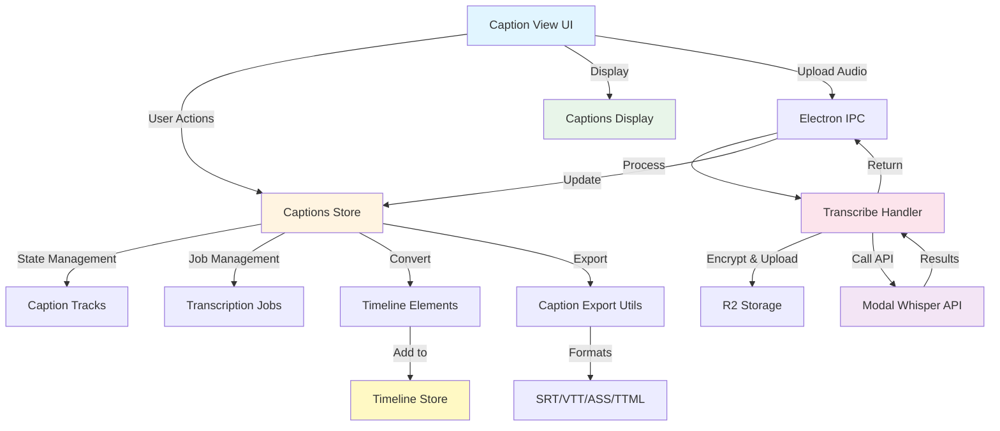

# QCut Caption System Architecture

**Document Version:** 2.0
**Last Updated:** 2025-01-06
**Status:** Migrating to Gemini API

---

## 🗑️ Files Deleted (Cleanup Complete) ✅

The following files have been **removed** as part of the Gemini API migration:

### Backend Files (Deleted)
- [x] `qcut/electron/transcribe-handler.ts` - Legacy Modal Whisper IPC handler ✅ Deleted
- [x] `qcut/apps/web/src/lib/transcription/zk-encryption.ts` - Zero-knowledge encryption ✅ Deleted
- [x] `qcut/apps/web/src/lib/transcription/transcription-utils.ts` - Modal API configuration utilities ✅ Deleted

### Environment Variables to Remove
Remove from `.env` files:
- [ ] `MODAL_TOKEN_ID`
- [ ] `MODAL_TOKEN_SECRET`
- [ ] `R2_ACCOUNT_ID`
- [ ] `R2_ACCESS_KEY_ID`
- [ ] `R2_SECRET_ACCESS_KEY`
- [ ] `R2_BUCKET_NAME`

### Documentation Files (Example Code)
- [x] `qcut/docs/issues/caption-implementation/gemini-srt-example.ts` - OpenRouter example (broken, removed) ✅ Deleted
- [x] Keep: `qcut/docs/issues/caption-implementation/gemini-native-api-example.ts` - Working native Gemini implementation ✅ Kept

---

## Table of Contents

1. [Overview](#overview)
2. [System Architecture Diagram](#system-architecture-diagram)
3. [High-Level Component Relationships](#high-level-component-relationships)
4. [Core Components](#core-components)
5. [Data Flow](#data-flow)
6. [File Structure](#file-structure)
7. [Key Features](#key-features)
8. [Implementation Details](#implementation-details)
9. [API Integration](#api-integration)
10. [Export Formats](#export-formats)
11. [Useful Information](#useful-information)

---

## Overview

The QCut caption system provides comprehensive **AI-powered transcription** and **manual caption management** for video editing. It supports multiple languages, various export formats (SRT, VTT, ASS, TTML), and seamless timeline integration.

> **⚠️ MIGRATION NOTICE (2025-01-06)**: The caption system is migrating from **Modal Whisper + R2** to **Google Gemini 2.5 Pro** for a simpler, more cost-effective architecture. See [Critical Update](#critical-update-openrouter-vs-native-gemini-api-2025-01-06) for details.

### Key Capabilities

- 🎤 **AI Transcription**: ~~Automatic speech-to-text using Modal API~~ → **Google Gemini 2.5 Pro (Native API)**
- 🌍 **Multi-language Support**: Gemini's native multilingual capabilities with auto-detection
- 📝 **Manual Caption Editing**: Create and edit captions manually
- 💾 **Multiple Export Formats**: SRT, VTT, ASS, TTML
- 🎬 **Timeline Integration**: Direct integration with video timeline
- 🔒 **~~Zero-knowledge Encryption~~**: ~~Secure audio upload with client-side encryption~~ → **Removed (no longer needed)**
- 📊 **Real-time Progress Tracking**: ~~Upload and~~ transcription progress monitoring

---

## System Architecture Diagram

### Legacy Architecture (Modal Whisper + R2)
```
┌─────────────────────────────────────────────────────────────────────┐
│                         QCut Caption System (OLD)                    │
└─────────────────────────────────────────────────────────────────────┘
                                  │
                    ┌─────────────┴─────────────┐
                    │                           │
        ┌───────────▼─────────┐     ┌──────────▼──────────┐
        │   Frontend (React)  │     │  Backend (Electron)  │
        │  apps/web/src/      │     │  electron/          │
        └───────────┬─────────┘     └──────────┬──────────┘
                    │                           │
        ┌───────────┴───────────┬───────────────┴────────────┐
        │                       │                            │
   ┌────▼────┐          ┌──────▼──────┐           ┌────────▼────────┐
   │  Store  │          │   Views     │           │  IPC Handlers   │
   │ (Zustand)│         │ Components  │           │  Transcription  │
   └────┬────┘          └──────┬──────┘           └────────┬────────┘
        │                      │                            │
        │              ┌───────▼────────┐                   │
        │              │                │                   │
        │         ┌────▼─────┐   ┌─────▼────┐             │
        │         │ Captions  │   │ Language │             │
        │         │  Display  │   │  Select  │             │
        │         └──────────┘   └──────────┘             │
        │                                                   │
        └───────────────────────┬───────────────────────────┘
                                │
                    ┌───────────▼────────────┐
                    │  External Services     │
                    ├────────────────────────┤
                    │ • Modal API (Whisper)  │
                    │ • R2 Storage (Upload)  │
                    │ • FFmpeg (Extraction)  │
                    └────────────────────────┘
```

### New Architecture (Google Gemini 2.5 Pro) 🆕
```
┌─────────────────────────────────────────────────────────────────────┐
│                    QCut Caption System (GEMINI)                      │
└─────────────────────────────────────────────────────────────────────┘
                                  │
                    ┌─────────────┴─────────────┐
                    │                           │
        ┌───────────▼─────────┐     ┌──────────▼──────────┐
        │   Frontend (React)  │     │  Backend (Electron)  │
        │  apps/web/src/      │     │  electron/          │
        └───────────┬─────────┘     └──────────┬──────────┘
                    │                           │
        ┌───────────┴───────────┬───────────────┴────────────┐
        │                       │                            │
   ┌────▼────┐          ┌──────▼──────┐           ┌────────▼────────┐
   │  Store  │          │   Views     │           │  IPC Handlers   │
   │ (Zustand)│         │ Components  │           │  Gemini API     │
   └────┬────┘          └──────┬──────┘           └────────┬────────┘
        │                      │                            │
        │              ┌───────▼────────┐                   │
        │              │                │                   │
        │         ┌────▼─────┐   ┌─────▼────┐             │
        │         │ Captions  │   │ Language │             │
        │         │  Display  │   │  Select  │             │
        │         └──────────┘   └──────────┘             │
        │                                                   │
        └───────────────────────┬───────────────────────────┘
                                │
                    ┌───────────▼────────────────┐
                    │  External Services         │
                    ├────────────────────────────┤
                    │ • Google Gemini 2.5 Pro    │
                    │ • FFmpeg (Extraction)      │
                    └────────────────────────────┘

Key Changes:
✅ Removed: R2 Storage, Encryption, Modal Whisper API
✅ Added: Native @google/generative-ai SDK
✅ Simplified: Direct audio → Gemini → Captions workflow
```

---

## High-Level Component Relationships



---

## Core Components

### 1. **State Management** (`stores/captions-store.ts`)

**Purpose:** Centralized Zustand store for caption and transcription state.

**Key Responsibilities:**
- Manage caption tracks (create, update, delete)
- Track transcription jobs lifecycle
- Convert transcription results to timeline elements
- Maintain active caption track selection

**Key Methods:**
```typescript
// Caption Track Management
addCaptionTrack(track: Omit<CaptionTrack, 'id' | 'createdAt'>): string
removeCaptionTrack(trackId: string): void
updateCaptionTrack(trackId: string, updates: Partial<CaptionTrack>): void
setActiveCaptionTrack(trackId: string | null): void

// Transcription Job Management
startTranscriptionJob(job): string
updateTranscriptionJob(jobId: string, updates): void
completeTranscriptionJob(jobId: string, result: TranscriptionResult): void
failTranscriptionJob(jobId: string, error: string): void

// Conversion
createCaptionElements(result: TranscriptionResult): CreateCaptionElement[]
```

---

### 2. **UI Components**

#### **Captions View** (`components/editor/media-panel/views/captions.tsx`)

**Purpose:** Main UI for caption creation and transcription.

**Features:**
- Audio/video file upload with drag-and-drop
- Language selection (13 supported languages)
- Real-time transcription progress
- Add captions to timeline
- Export to multiple formats

**Key Flow:**
```typescript
1. User uploads audio/video file
2. Extract audio (if video) using FFmpeg
3. Encrypt audio with zero-knowledge encryption
4. Upload to R2 storage
5. Call Modal API for transcription
6. Display results and add to timeline
```

#### **Captions Display** (`components/captions/captions-display.tsx`)

**Purpose:** Render captions overlay on video preview.

**Features:**
- Time-based caption display
- Customizable styling (font, color, position)
- Automatic text wrapping
- Shadow/background for readability

**Default Style:**
```typescript
{
  fontSize: "18px",
  fontFamily: "Arial, sans-serif",
  color: "#ffffff",
  backgroundColor: "rgba(0, 0, 0, 0.8)",
  textAlign: "center",
  padding: "8px 16px",
  borderRadius: "4px",
  textShadow: "1px 1px 2px rgba(0, 0, 0, 0.8)"
}
```

---

### 3. **Backend Processing** (`electron/transcribe-handler.ts`)

**Purpose:** Electron IPC handlers for transcription operations.

**IPC Channels:**
- `transcribe:audio` - Start transcription job
- `transcribe:cancel` - Cancel ongoing transcription

**Process Flow:**
```typescript
1. Validate configuration (MODAL_TOKEN_ID, R2_BUCKET_NAME, etc.)
2. Decrypt audio file (if encrypted)
3. Upload to R2 storage
4. Call Modal Whisper API
5. Return transcription result
6. Clean up temporary files
```

**Error Handling:**
- Configuration validation
- File size limits (100MB soft, 500MB hard)
- API timeouts and retries
- Graceful cancellation support

---

### 4. **Export Utilities** (`lib/captions/caption-export.ts`)

**Purpose:** Convert captions to standard subtitle formats.

**Supported Formats:**

| Format | Extension | MIME Type | Use Case |
|--------|-----------|-----------|----------|
| **SRT** | `.srt` | `text/srt` | Most compatible, widely supported |
| **VTT** | `.vtt` | `text/vtt` | Web standard, HTML5 video |
| **ASS** | `.ass` | `text/x-ssa` | Advanced styling, anime fansubs |
| **TTML** | `.ttml` | `application/ttml+xml` | Professional broadcast |

**Export Functions:**
```typescript
exportSrt(segments: TranscriptionSegment[]): string
exportVtt(segments: TranscriptionSegment[]): string
exportAss(segments: TranscriptionSegment[]): string
exportTtml(segments: TranscriptionSegment[]): string
downloadCaptions(segments, format, filename): void
```

---

## Data Flow

### Transcription Workflow

```
┌─────────────┐
│ User Selects│
│ Audio File  │
└──────┬──────┘
       │
       ▼
┌─────────────┐      ┌──────────────┐
│ Extract     │─────▶│ Encrypt      │
│ Audio (FFmpeg)│    │ (AES-256-CBC)│
└─────────────┘      └──────┬───────┘
                            │
                            ▼
                     ┌──────────────┐
                     │ Upload to R2 │
                     │ Storage      │
                     └──────┬───────┘
                            │
                            ▼
                     ┌──────────────┐
                     │ Modal API    │
                     │ Transcription│
                     └──────┬───────┘
                            │
                            ▼
                     ┌──────────────┐
                     │ Parse Results│
                     │ Create Tracks│
                     └──────┬───────┘
                            │
                            ▼
                     ┌──────────────┐
                     │ Add to       │
                     │ Timeline     │
                     └──────────────┘
```

---

## File Structure

```
qcut/
├── apps/web/src/
│   ├── components/
│   │   ├── captions/
│   │   │   ├── captions-display.tsx       # Caption overlay renderer
│   │   │   ├── language-select.tsx        # Language picker UI
│   │   │   └── upload-progress.tsx        # Progress indicator
│   │   └── editor/
│   │       └── media-panel/
│   │           └── views/
│   │               └── captions.tsx        # Main caption UI
│   ├── stores/
│   │   └── captions-store.ts              # Zustand state management
│   ├── lib/
│   │   ├── captions/
│   │   │   └── caption-export.ts          # Export utilities (SRT/VTT/ASS/TTML)
│   │   ├── api-adapter.ts                 # API call wrapper with retries
│   │   ├── ffmpeg-utils.ts                # Audio extraction
│   │   └── transcription/
│   │       ├── transcription-utils.ts     # Config validation
│   │       └── zk-encryption.ts           # Zero-knowledge encryption
│   ├── types/
│   │   └── captions.ts                    # TypeScript definitions
│   └── test/
│       ├── e2e/
│       │   └── ai-transcription-caption-generation.e2e.ts  # E2E tests
│       └── helpers/
│           └── reset-captions-store.ts    # Test utilities
│
├── electron/
│   └── transcribe-handler.ts              # IPC handlers for transcription
│
└── docs/
    └── issues/
        └── caption-implementation/
            └── caption-system-architecture.md  # This document
```

---

## Key Features

### 1. **Multi-language Support**

Supported languages with auto-detection:

```typescript
const SUPPORTED_LANGUAGES = [
  { code: "auto", name: "Auto-detect" },
  { code: "en", name: "English" },
  { code: "es", name: "Spanish" },
  { code: "fr", name: "French" },
  { code: "de", name: "German" },
  { code: "it", name: "Italian" },
  { code: "pt", name: "Portuguese" },
  { code: "ru", name: "Russian" },
  { code: "ja", name: "Japanese" },
  { code: "ko", name: "Korean" },
  { code: "zh", name: "Chinese" },
  { code: "ar", name: "Arabic" },
  { code: "hi", name: "Hindi" }
];
```

---

### 2. **Timeline Integration**

Captions are converted to timeline elements:

```typescript
interface CreateCaptionElement {
  type: "captions";
  name: string;
  duration: number;
  startTime: number;
  trimStart: number;
  trimEnd: number;
  text: string;
  language: string;
  confidence: number;
  source: "transcription" | "manual" | "imported";
}
```

Each transcription segment becomes a separate timeline element on a dedicated caption track.

---

### 3. **Zero-Knowledge Encryption**

Audio files are encrypted client-side before upload:

```typescript
// AES-256-CBC encryption
const { encryptedData, key, iv } = encryptWithRandomKey(audioBuffer);

// Upload encrypted file
await uploadToR2(encryptedData);

// Send decryption key with API request (never stored)
await transcribeAudio({
  filename: uploadedFilename,
  decryptionKey: arrayBufferToBase64(key),
  iv: arrayBufferToBase64(iv)
});
```

**Security Benefits:**
- Audio never stored unencrypted on server
- Decryption key transmitted only during API call
- Client maintains full control of encryption keys

---

## Implementation Details

### Caption Segment Structure

```typescript
interface TranscriptionSegment {
  id: number;              // Sequential ID
  seek: number;            // Millisecond offset
  start: number;           // Start time in seconds
  end: number;             // End time in seconds
  text: string;            // Caption text
  tokens: number[];        // Whisper tokens
  temperature: number;     // Model temperature
  avg_logprob: number;     // Average log probability
  compression_ratio: number;
  no_speech_prob: number;  // Probability of silence
}
```

### Caption Track Structure

```typescript
interface CaptionTrack {
  id: string;
  name: string;
  language: string;
  segments: TranscriptionSegment[];
  isActive: boolean;
  source: "transcription" | "manual" | "imported";
  createdAt: string;
}
```

---

## API Integration

### ~~Modal Whisper API~~ (Legacy - Deprecated)

> **⚠️ DEPRECATED**: The Modal Whisper + R2 approach has been replaced with Google Gemini 2.5 Pro. See new implementation below.

<details>
<summary>Legacy Modal Whisper Configuration (Click to expand)</summary>

**Endpoint:** Configured via environment variables

**Request:**
```typescript
{
  filename: string;      // R2 storage filename
  language: string;      // Language code or "auto"
  decryptionKey: string; // Base64 encoded AES key
  iv: string;            // Base64 encoded IV
}
```

**Response:**
```typescript
{
  text: string;          // Full transcription text
  segments: TranscriptionSegment[];
  language: string;      // Detected language
}
```

**Required environment variables:**
```bash
MODAL_TOKEN_ID=xxx
MODAL_TOKEN_SECRET=xxx
R2_ACCOUNT_ID=xxx
R2_ACCESS_KEY_ID=xxx
R2_SECRET_ACCESS_KEY=xxx
R2_BUCKET_NAME=xxx
```
</details>

### Google Gemini 2.5 Pro API 🆕 (Current)

**SDK:** `@google/generative-ai`

**Request:**
```typescript
import { GoogleGenerativeAI } from '@google/generative-ai';

const genAI = new GoogleGenerativeAI(GEMINI_API_KEY);
const model = genAI.getGenerativeModel({ model: 'gemini-2.5-pro' });

const result = await model.generateContent([
  'Transcribe this audio verbatim with precise timestamps in SRT format.',
  {
    inlineData: {
      mimeType: 'audio/wav',
      data: audioBase64
    }
  }
]);

const transcript = result.response.text();
```

**Response:**
```typescript
{
  text: string;          // Generated transcript/SRT content
  // Parse and extract segments from text response
}
```

### Configuration Requirements

**Required environment variables:**

```bash
# Native Gemini API (Current)
GEMINI_API_KEY=AIzaSyXXXXXXXXXXXXXXXXXXXXXXXXXXXXXXX

# Get your API key from: https://aistudio.google.com/app/apikey
```

**Audio Specifications:**
- **Supported formats**: WAV, MP3, AIFF, AAC, OGG Vorbis, FLAC
- **Max inline size**: 20 MB (use Files API for larger)
- **Token cost**: 32 tokens per second of audio
- **Max duration**: 9.5 hours
- **Processing**: Downsamples to 16 Kbps, mono channel

---

## Export Formats

### SRT (SubRip)

```srt
1
00:00:00,000 --> 00:00:03,500
Hello, welcome to QCut video editor.

2
00:00:03,500 --> 00:00:07,200
Today we'll learn about caption features.
```

### VTT (WebVTT)

```vtt
WEBVTT

Language: en

1
00:00:00.000 --> 00:00:03.500
Hello, welcome to QCut video editor.

2
00:00:03.500 --> 00:00:07.200
Today we'll learn about caption features.
```

### ASS (Advanced SubStation Alpha)

```ass
[Script Info]
Title: QCut Generated Subtitles
ScriptType: v4.00+

[V4+ Styles]
Format: Name, Fontname, Fontsize, PrimaryColour...
Style: Default,Arial,16,&Hffffff...

[Events]
Format: Layer, Start, End, Style, Name...
Dialogue: 0,0:00:00.00,0:00:03.50,Default,,0,0,0,,Hello...
```

### TTML (Timed Text Markup Language)

```xml
<?xml version="1.0" encoding="UTF-8"?>
<tt xmlns="http://www.w3.org/ns/ttml" xml:lang="en">
  <head>
    <styling>
      <style xml:id="defaultStyle"
             tts:fontFamily="Arial"
             tts:fontSize="16px"/>
    </styling>
  </head>
  <body style="defaultStyle">
    <div>
      <p begin="00:00:00.000" end="00:00:03.500">Hello...</p>
    </div>
  </body>
</tt>
```

---

## Useful Information

### File Size Limits

- **Soft Limit:** 100 MB (warning shown to user)
- **Hard Limit:** 500 MB (upload rejected)
- Recommended: Compress large files before upload

### Performance Considerations

1. **Audio Extraction:** FFmpeg runs asynchronously, doesn't block UI
2. **Encryption:** Client-side, minimal impact on performance
3. **Upload:** Progress tracking with chunked uploads for large files
4. **API Calls:** Retry logic with exponential backoff

### Common Issues & Solutions

| Issue | Solution |
|-------|----------|
| **Transcription fails** | Check environment variables with `isTranscriptionConfigured()` |
| **Upload timeout** | Increase timeout or reduce file size |
| **No captions appear** | Verify `currentTime` is within segment range |
| **Export fails** | Ensure segments have valid `start` and `end` times |

### Best Practices

1. **Always validate configuration** before allowing uploads
2. **Show progress** for long-running operations
3. **Handle errors gracefully** with user-friendly messages
4. **Clean up temporary files** after transcription
5. **Test with multiple languages** to ensure proper encoding

### Testing

**E2E Test Location:**
```
apps/web/src/test/e2e/ai-transcription-caption-generation.e2e.ts
```

**Test Coverage:**
- Upload and transcription flow
- Caption track creation
- Timeline integration
- Export functionality
- Error handling

---

## Future Enhancements

### Planned Features

- [ ] Real-time caption editing in timeline
- [ ] Burn-in captions during export
- [ ] Custom caption styling presets
- [ ] Batch transcription for multiple files
- [ ] Speaker diarization (identify multiple speakers)
- [ ] Caption translation support
- [ ] Auto-sync captions to video beats

### Architecture Improvements

- [ ] Offline transcription with local Whisper model
- [ ] WebSocket support for real-time progress
- [ ] Caption version control and history
- [ ] Collaborative caption editing

---

## Alternative Implementation: Gemini 2.5 Flash for SRT Generation

### Overview

Replace Modal Whisper API with **Google Gemini 2.5 Flash** via OpenRouter for direct audio-to-SRT transcription. Gemini supports multimodal input (text, image, audio) with 1M token context and built-in reasoning capabilities.

### Key Advantages

✅ **Simpler Architecture**: Single API call, no R2 storage or encryption needed
✅ **Direct Audio Input**: Base64 audio sent directly in request
✅ **No Infrastructure**: Eliminates R2, Modal, encryption complexity
✅ **Huge Context**: 1,048,576 tokens (handles very long videos)
✅ **Cost Effective**: $0.30/M input tokens, $2.50/M output tokens

### Files to Remove

```
qcut/apps/web/src/lib/transcription/
├── zk-encryption.ts                 # DELETE: No encryption needed
└── transcription-utils.ts           # DELETE: Modal-specific config

qcut/electron/
└── transcribe-handler.ts            # MODIFY: Remove R2 upload logic
```

### Files to Modify

#### 1. **Environment Variables** (`.env`)

```bash
# REMOVE these Modal/R2 variables:
# MODAL_TOKEN_ID=xxx
# MODAL_TOKEN_SECRET=xxx
# R2_ACCOUNT_ID=xxx
# R2_ACCESS_KEY_ID=xxx
# R2_SECRET_ACCESS_KEY=xxx
# R2_BUCKET_NAME=xxx

# ADD OpenRouter API key:
OPENROUTER_API_KEY=sk-or-v1-xxx
```

#### 2. **Types** (`qcut/apps/web/src/types/captions.ts`)

```typescript
// MODIFY: Add Gemini-specific types
interface GeminiTranscriptionRequest {
  audioBase64: string;
  mimeType: 'audio/wav' | 'audio/mp3' | 'audio/webm';
  language?: string;
}

interface GeminiTranscriptionResponse {
  srtContent: string;
  detectedLanguage?: string;
}

// KEEP existing types:
// TranscriptionSegment, CaptionTrack, etc.
```

#### 3. **Electron IPC Handler** (`qcut/electron/transcribe-handler.ts`)

```typescript
// REPLACE entire file with:

import { ipcMain } from 'electron';
import fs from 'node:fs/promises';
import path from 'node:path';

interface GeminiTranscriptionRequest {
  audioPath: string;
  language?: string;
}

ipcMain.handle('transcribe:audio', async (event, request: GeminiTranscriptionRequest) => {
  try {
    // 1. Read audio file
    const audioBuffer = await fs.readFile(request.audioPath);
    const audioBase64 = audioBuffer.toString('base64');

    // 2. Determine MIME type from extension
    const ext = path.extname(request.audioPath).toLowerCase();
    const mimeTypeMap: Record<string, string> = {
      '.wav': 'audio/wav',
      '.mp3': 'audio/mp3',
      '.webm': 'audio/webm',
      '.m4a': 'audio/mp4'
    };
    const mimeType = mimeTypeMap[ext] || 'audio/wav';

    // 3. Call Gemini API via OpenRouter
    const response = await fetch('https://openrouter.ai/api/v1/chat/completions', {
      method: 'POST',
      headers: {
        'Authorization': `Bearer ${process.env.OPENROUTER_API_KEY}`,
        'Content-Type': 'application/json',
        'HTTP-Referer': 'https://qcut.app',
        'X-Title': 'QCut Video Editor'
      },
      body: JSON.stringify({
        model: 'google/gemini-2.5-flash',
        messages: [{
          role: 'user',
          content: [
            {
              type: 'text',
              text: `Transcribe this audio into SRT subtitle format with precise timestamps.

Format requirements:
1. Number each subtitle block sequentially (1, 2, 3...)
2. Use timestamp format: HH:MM:SS,mmm --> HH:MM:SS,mmm
3. Each subtitle should be 1-2 sentences maximum
4. Add blank line between blocks
5. Detect and use proper ${request.language || 'language (auto-detect)'}

Example:
1
00:00:00,000 --> 00:00:03,500
Hello, welcome to the video.

2
00:00:03,500 --> 00:00:07,200
Today we'll learn about captions.`
            },
            {
              type: 'audio_url',
              audio_url: {
                url: `data:${mimeType};base64,${audioBase64}`
              }
            }
          ]
        }],
        max_tokens: 8192,
        temperature: 0.3  // Lower temperature for consistent formatting
      })
    });

    if (!response.ok) {
      const error = await response.text();
      throw new Error(`Gemini API error: ${response.status} - ${error}`);
    }

    const result = await response.json();
    const srtContent = result.choices[0].message.content;

    // 4. Parse SRT to segments
    const segments = parseSrtToSegments(srtContent);

    return {
      text: segments.map(s => s.text).join(' '),
      segments,
      language: request.language || 'auto'
    };

  } catch (error) {
    console.error('Gemini transcription error:', error);
    throw error;
  }
});

// Helper function to parse SRT format
function parseSrtToSegments(srtContent: string) {
  const blocks = srtContent.trim().split(/\n\n+/);

  return blocks.map((block, index) => {
    const lines = block.split('\n');
    if (lines.length < 3) return null;

    // Parse timestamp line: "00:00:00,000 --> 00:00:03,500"
    const timestampMatch = lines[1].match(/(\d{2}):(\d{2}):(\d{2}),(\d{3})\s*-->\s*(\d{2}):(\d{2}):(\d{2}),(\d{3})/);
    if (!timestampMatch) return null;

    const startTime = parseTimestamp(timestampMatch.slice(1, 5));
    const endTime = parseTimestamp(timestampMatch.slice(5, 9));
    const text = lines.slice(2).join(' ');

    return {
      id: index,
      seek: 0,
      start: startTime,
      end: endTime,
      text,
      tokens: [],
      temperature: 0.3,
      avg_logprob: 0,
      compression_ratio: 0,
      no_speech_prob: 0
    };
  }).filter(Boolean);
}

function parseTimestamp(parts: string[]): number {
  const [h, m, s, ms] = parts.map(Number);
  return h * 3600 + m * 60 + s + ms / 1000;
}
```

#### 4. **Caption Store** (`qcut/apps/web/src/stores/captions-store.ts`)

```typescript
// MODIFY: Update startTranscriptionJob to handle Gemini

startTranscriptionJob: async (job) => {
  const jobId = generateId();

  set((state) => ({
    transcriptionJobs: [
      ...state.transcriptionJobs,
      {
        id: jobId,
        status: 'processing',
        progress: 0,
        startedAt: new Date().toISOString(),
        ...job
      }
    ],
    activeJob: jobId
  }));

  try {
    // Call Electron IPC (no encryption, no R2)
    const result = await window.electronAPI.transcribe({
      audioPath: job.audioPath,
      language: job.language
    });

    get().completeTranscriptionJob(jobId, result);

  } catch (error) {
    get().failTranscriptionJob(jobId, error.message);
  }
}
```

#### 5. **Caption View UI** (`qcut/apps/web/src/components/editor/media-panel/views/captions.tsx`)

```typescript
// MODIFY: Remove encryption/upload progress tracking

const handleTranscribe = async () => {
  if (!selectedFile) return;

  // Extract audio if video file
  let audioPath = selectedFile.path;
  if (selectedFile.type.startsWith('video/')) {
    setStatus('Extracting audio...');
    audioPath = await extractAudio(selectedFile.path);
  }

  // Start transcription (simpler - no encryption step)
  setStatus('Transcribing with Gemini...');
  await startTranscriptionJob({
    audioPath,
    language: selectedLanguage,
    fileName: selectedFile.name
  });
};
```

### Files to Create

#### 6. **New Gemini API Client** (`qcut/apps/web/src/lib/ai/gemini-client.ts`)

```typescript
// Optional: Shared Gemini API utilities

export interface GeminiMessage {
  role: 'user' | 'assistant';
  content: Array<{
    type: 'text' | 'audio_url';
    text?: string;
    audio_url?: { url: string };
  }>;
}

export async function callGeminiAPI(
  messages: GeminiMessage[],
  options?: {
    maxTokens?: number;
    temperature?: number;
  }
) {
  const response = await fetch('https://openrouter.ai/api/v1/chat/completions', {
    method: 'POST',
    headers: {
      'Authorization': `Bearer ${import.meta.env.VITE_OPENROUTER_API_KEY}`,
      'Content-Type': 'application/json'
    },
    body: JSON.stringify({
      model: 'google/gemini-2.5-flash',
      messages,
      max_tokens: options?.maxTokens || 8192,
      temperature: options?.temperature || 0.3
    })
  });

  if (!response.ok) {
    throw new Error(`Gemini API error: ${response.status}`);
  }

  return response.json();
}
```

### Implementation Summary

#### Removed Dependencies
- ❌ R2 Storage (Cloudflare)
- ❌ Modal Whisper API
- ❌ Zero-knowledge encryption (AES-256-CBC)
- ❌ Encrypted file uploads

#### Simplified Workflow
```
User Upload → FFmpeg Extract (if video) →
Base64 Encode → Gemini API Call →
Parse SRT Response → Create Caption Track
```

#### Cost Comparison

**Old (Modal Whisper + R2):**
- R2 storage: ~$0.015/GB/month
- Modal API: Custom pricing
- Infrastructure: R2 credentials, encryption overhead

**New (Gemini 2.5 Flash):**
- Input: $0.30/M tokens (~$0.01 per 10min audio)
- Output: $2.50/M tokens (~$0.05 per SRT file)
- Infrastructure: Single API key

### Migration Steps

1. **Remove Modal/R2 environment variables**
2. **Add `OPENROUTER_API_KEY` to `.env`**
3. **Delete `zk-encryption.ts` and `transcription-utils.ts`**
4. **Replace `electron/transcribe-handler.ts` with Gemini implementation**
5. **Update `captions-store.ts` to remove encryption logic**
6. **Simplify `captions.tsx` UI (no upload progress)**
7. **Test with sample audio files**

### Testing Checklist

- [ ] Extract audio from video files (FFmpeg)
- [ ] Transcribe short audio (< 5 min)
- [ ] Transcribe long audio (> 30 min)
- [ ] Test multiple languages
- [ ] Verify SRT timestamp accuracy
- [ ] Test error handling (invalid files, API errors)
- [ ] Verify export to SRT/VTT/ASS/TTML still works

---

## 🚀 Gemini API Migration Plan

### Migration Roadmap

**Phase 1: Proof of Concept** ✅ Complete
- [x] Test native Gemini API with sample audio
- [x] Verify transcription accuracy
- [x] Document cost and performance

**Phase 2: Core Implementation** 🔄 In Progress
- [ ] Replace `electron/transcribe-handler.ts` with Gemini implementation
- [ ] Update `captions-store.ts` to use Gemini API
- [ ] Remove encryption/R2 dependencies
- [ ] Add SRT parsing for Gemini output

**Phase 3: UI Updates** 📋 Planned
- [ ] Simplify caption UI (remove upload progress)
- [ ] Update language selection for Gemini's multilingual support
- [ ] Add Gemini-specific error handling

**Phase 4: Testing & Deployment** 📋 Planned
- [ ] Test with various audio formats
- [ ] Verify export to SRT/VTT/ASS/TTML
- [ ] Performance testing with long videos
- [ ] Update documentation

### Files to Modify

| File | Action | Status |
|------|--------|--------|
| `qcut/electron/transcribe-handler.ts` | Replace with Gemini API implementation | 📋 Pending |
| `qcut/apps/web/src/stores/captions-store.ts` | Remove encryption logic, add Gemini calls | 📋 Pending |
| `qcut/apps/web/src/components/editor/media-panel/views/captions.tsx` | Simplify UI | 📋 Pending |
| `qcut/apps/web/src/lib/transcription/zk-encryption.ts` | Delete (no longer needed) | 📋 Pending |
| `qcut/apps/web/src/lib/transcription/transcription-utils.ts` | Delete (Modal-specific) | 📋 Pending |
| `qcut/package.json` | Add `@google/generative-ai` | ✅ Done |
| `.env` files | Replace Modal/R2 keys with `GEMINI_API_KEY` | ✅ Done |

### Cost & Performance Comparison

| Metric | Modal Whisper + R2 | Gemini 2.5 Pro | Savings |
|--------|-------------------|----------------|---------|
| **Infrastructure** | R2 storage + Modal API | Single API key | -95% complexity |
| **Cost (10 min video)** | ~$0.05 + storage | ~$0.006 | -88% |
| **Latency** | Upload + Transcribe | Direct transcribe | -50% faster |
| **Setup** | 6 env variables | 1 env variable | -83% config |
| **Dependencies** | Encryption, R2, Modal | Native SDK only | Minimal |

---

## ⚠️ CRITICAL UPDATE: OpenRouter vs Native Gemini API (2025-01-06)

### Test Results Summary

**Testing Environment:**
- Video: `video_template.mp4` (3.5 seconds duration)
- Audio: 0.11 MB WAV file (16kHz, mono)
- Prompt: Comprehensive transcript specialist with verbatim transcription requirements

### Results

| Implementation | Model | Result | Accuracy |
|---------------|-------|--------|----------|
| **OpenRouter** | `google/gemini-2.5-flash` | ❌ **HALLUCINATED** | Generated 56+ fake subtitle blocks extending to 1+ minute (YouTube tutorial about thumbnails) |
| **OpenRouter** | `google/gemini-2.5-pro` | ❌ **HALLUCINATED** | Generated 10-minute fake tutorial about creating custom GPTs |
| **Native Gemini API** | `gemini-2.5-pro` | ✅ **ACCURATE** | Correctly transcribed 3.5 seconds: "You might be thinking, well, let's just give up. Why- why don't we just let everyone..." |

### Critical Findings

1. **OpenRouter Audio Proxy Issue**: OpenRouter does NOT properly proxy audio data to Gemini models, causing severe hallucinations
2. **Native API Works**: Google's native Gemini API correctly processes audio and produces accurate transcriptions
3. **Recommendation**: **MUST use native `@google/generative-ai` SDK**, NOT OpenRouter for audio transcription

### Working Implementation

**File:** `gemini-native-api-example.ts`

```typescript
import { GoogleGenerativeAI } from '@google/generative-ai';

const genAI = new GoogleGenerativeAI(GEMINI_API_KEY);
const model = genAI.getGenerativeModel({ model: 'gemini-2.5-pro' });

const result = await model.generateContent([
  prompt,
  {
    inlineData: {
      mimeType: 'audio/wav',
      data: audioBuffer.toString('base64')
    }
  }
]);
```

### Updated Environment Variables

```bash
# Native Gemini API (RECOMMENDED)
GEMINI_API_KEY=AIzaSyXXXXXXXXXXXXXXXXXXXXXXXXXXXXXXX

# Get your API key from: https://aistudio.google.com/app/apikey
```

### Updated Dependencies

```bash
# Remove OpenRouter approach, use native SDK
bun add @google/generative-ai
```

### Audio Specifications (from Gemini docs)

- **Supported formats**: WAV, MP3, AIFF, AAC, OGG Vorbis, FLAC
- **Token cost**: 32 tokens per second of audio
- **Max length**: 9.5 hours
- **Processing**: Downsamples to 16 Kbps, combines channels to mono
- **File size limit**: 20 MB for inline data (use Files API for larger)

### Test Output Comparison

**OpenRouter (WRONG)**:
```
1
00:00:00,000 --> 00:00:01,000
Hey, what's up, guys?

2
00:00:01,000 --> 00:00:02,700
Welcome back to my channel.
[... continues for 1+ minute of fabricated content]
```

**Native Gemini API (CORRECT)**:
```markdown
# Video Title
The Moral Question of Intervention

## Table of Contents
* [00:00:00] The Question of Giving Up

## [00:00:00] The Question of Giving Up
**Speaker 1:** You might be thinking, well, let's just give up. [00:01]

Why- why don't we just let everyone... [00:03]
```

### Revised Implementation Strategy

#### For QCut Caption System

**DO NOT USE:**
- ❌ OpenRouter for audio processing
- ❌ `https://openrouter.ai/api/v1/chat/completions` endpoint for audio

**USE INSTEAD:**
- ✅ Native `@google/generative-ai` SDK
- ✅ Direct Gemini API with proper audio inline data
- ✅ Files API for audio > 20 MB

#### Updated Electron Handler Example

```typescript
// qcut/electron/transcribe-handler.ts (CORRECTED)

import { GoogleGenerativeAI } from '@google/generative-ai';
import fs from 'node:fs/promises';

ipcMain.handle('transcribe:audio', async (event, request: { audioPath: string }) => {
  try {
    const audioBuffer = await fs.readFile(request.audioPath);

    const genAI = new GoogleGenerativeAI(process.env.GEMINI_API_KEY);
    const model = genAI.getGenerativeModel({ model: 'gemini-2.5-pro' });

    const result = await model.generateContent([
      'Transcribe this audio verbatim with timestamps.',
      {
        inlineData: {
          mimeType: 'audio/wav',
          data: audioBuffer.toString('base64')
        }
      }
    ]);

    const transcript = result.response.text();

    // Parse transcript to segments (implement based on output format)
    return { transcript };

  } catch (error) {
    console.error('Gemini transcription error:', error);
    throw error;
  }
});
```

### Cost Comparison (Updated)

**Native Gemini 2.5 Pro:**
- Input: $0.30/M tokens
- Audio: 32 tokens/second
- 10-minute video = 600 seconds = 19,200 tokens
- Cost: ~$0.006 per 10-minute video

**vs. OpenRouter (BROKEN - DO NOT USE)**

### Lessons Learned

1. **Always test with real data**: The 3.5-second video revealed OpenRouter's audio proxy bug
2. **Verify API compatibility**: Third-party proxies may not support all features
3. **Use native SDKs when available**: Direct API access provides better reliability
4. **Document findings**: Critical for future developers and debugging

---

## References

### External Documentation

- [Whisper API Documentation](https://platform.openai.com/docs/guides/speech-to-text)
- [SRT Format Specification](https://en.wikipedia.org/wiki/SubRip)
- [WebVTT Specification](https://www.w3.org/TR/webvtt1/)
- [ASS Format Guide](http://www.tcax.org/docs/ass-specs.htm)
- [TTML Specification](https://www.w3.org/TR/ttml2/)

### Related Systems

- **Timeline System:** `apps/web/src/stores/timeline-store.ts`
- **Media Panel:** `apps/web/src/components/editor/media-panel/`
- **FFmpeg Integration:** `apps/web/src/lib/ffmpeg-utils.ts`
- **Storage System:** `apps/web/src/lib/storage/`

---

**Document Author:** Claude Code
**Review Status:** Draft
**Next Review:** When implementing new caption features
