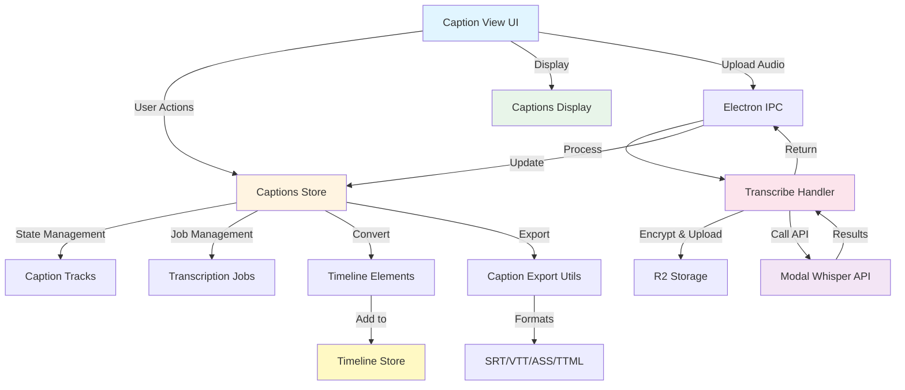

# QCut Caption System Architecture

**Document Version:** 1.0
**Last Updated:** 2025-10-05
**Status:** Active Implementation

---

## Table of Contents

1. [Overview](#overview)
2. [System Architecture Diagram](#system-architecture-diagram)
3. [High-Level Component Relationships](#high-level-component-relationships)
4. [Core Components](#core-components)
5. [Data Flow](#data-flow)
6. [File Structure](#file-structure)
7. [Key Features](#key-features)
8. [Implementation Details](#implementation-details)
9. [API Integration](#api-integration)
10. [Export Formats](#export-formats)
11. [Useful Information](#useful-information)

---

## Overview

The QCut caption system provides comprehensive **AI-powered transcription** and **manual caption management** for video editing. It supports multiple languages, various export formats (SRT, VTT, ASS, TTML), and seamless timeline integration.

### Key Capabilities

- 🎤 **AI Transcription**: Automatic speech-to-text using Modal API
- 🌍 **Multi-language Support**: 13 languages including auto-detect
- 📝 **Manual Caption Editing**: Create and edit captions manually
- 💾 **Multiple Export Formats**: SRT, VTT, ASS, TTML
- 🎬 **Timeline Integration**: Direct integration with video timeline
- 🔒 **Zero-knowledge Encryption**: Secure audio upload with client-side encryption
- 📊 **Real-time Progress Tracking**: Upload and transcription progress monitoring

---

## System Architecture Diagram

```
┌─────────────────────────────────────────────────────────────────────┐
│                         QCut Caption System                          │
└─────────────────────────────────────────────────────────────────────┘
                                  │
                    ┌─────────────┴─────────────┐
                    │                           │
        ┌───────────▼─────────┐     ┌──────────▼──────────┐
        │   Frontend (React)  │     │  Backend (Electron)  │
        │  apps/web/src/      │     │  electron/          │
        └───────────┬─────────┘     └──────────┬──────────┘
                    │                           │
        ┌───────────┴───────────┬───────────────┴────────────┐
        │                       │                            │
   ┌────▼────┐          ┌──────▼──────┐           ┌────────▼────────┐
   │  Store  │          │   Views     │           │  IPC Handlers   │
   │ (Zustand)│         │ Components  │           │  Transcription  │
   └────┬────┘          └──────┬──────┘           └────────┬────────┘
        │                      │                            │
        │              ┌───────▼────────┐                   │
        │              │                │                   │
        │         ┌────▼─────┐   ┌─────▼────┐             │
        │         │ Captions  │   │ Language │             │
        │         │  Display  │   │  Select  │             │
        │         └──────────┘   └──────────┘             │
        │                                                   │
        └───────────────────────┬───────────────────────────┘
                                │
                    ┌───────────▼────────────┐
                    │  External Services     │
                    ├────────────────────────┤
                    │ • Modal API (Whisper)  │
                    │ • R2 Storage (Upload)  │
                    │ • FFmpeg (Extraction)  │
                    └────────────────────────┘
```

---

## High-Level Component Relationships



---

## Core Components

### 1. **State Management** (`stores/captions-store.ts`)

**Purpose:** Centralized Zustand store for caption and transcription state.

**Key Responsibilities:**
- Manage caption tracks (create, update, delete)
- Track transcription jobs lifecycle
- Convert transcription results to timeline elements
- Maintain active caption track selection

**Key Methods:**
```typescript
// Caption Track Management
addCaptionTrack(track: Omit<CaptionTrack, 'id' | 'createdAt'>): string
removeCaptionTrack(trackId: string): void
updateCaptionTrack(trackId: string, updates: Partial<CaptionTrack>): void
setActiveCaptionTrack(trackId: string | null): void

// Transcription Job Management
startTranscriptionJob(job): string
updateTranscriptionJob(jobId: string, updates): void
completeTranscriptionJob(jobId: string, result: TranscriptionResult): void
failTranscriptionJob(jobId: string, error: string): void

// Conversion
createCaptionElements(result: TranscriptionResult): CreateCaptionElement[]
```

---

### 2. **UI Components**

#### **Captions View** (`components/editor/media-panel/views/captions.tsx`)

**Purpose:** Main UI for caption creation and transcription.

**Features:**
- Audio/video file upload with drag-and-drop
- Language selection (13 supported languages)
- Real-time transcription progress
- Add captions to timeline
- Export to multiple formats

**Key Flow:**
```typescript
1. User uploads audio/video file
2. Extract audio (if video) using FFmpeg
3. Encrypt audio with zero-knowledge encryption
4. Upload to R2 storage
5. Call Modal API for transcription
6. Display results and add to timeline
```

#### **Captions Display** (`components/captions/captions-display.tsx`)

**Purpose:** Render captions overlay on video preview.

**Features:**
- Time-based caption display
- Customizable styling (font, color, position)
- Automatic text wrapping
- Shadow/background for readability

**Default Style:**
```typescript
{
  fontSize: "18px",
  fontFamily: "Arial, sans-serif",
  color: "#ffffff",
  backgroundColor: "rgba(0, 0, 0, 0.8)",
  textAlign: "center",
  padding: "8px 16px",
  borderRadius: "4px",
  textShadow: "1px 1px 2px rgba(0, 0, 0, 0.8)"
}
```

---

### 3. **Backend Processing** (`electron/transcribe-handler.ts`)

**Purpose:** Electron IPC handlers for transcription operations.

**IPC Channels:**
- `transcribe:audio` - Start transcription job
- `transcribe:cancel` - Cancel ongoing transcription

**Process Flow:**
```typescript
1. Validate configuration (MODAL_TOKEN_ID, R2_BUCKET_NAME, etc.)
2. Decrypt audio file (if encrypted)
3. Upload to R2 storage
4. Call Modal Whisper API
5. Return transcription result
6. Clean up temporary files
```

**Error Handling:**
- Configuration validation
- File size limits (100MB soft, 500MB hard)
- API timeouts and retries
- Graceful cancellation support

---

### 4. **Export Utilities** (`lib/captions/caption-export.ts`)

**Purpose:** Convert captions to standard subtitle formats.

**Supported Formats:**

| Format | Extension | MIME Type | Use Case |
|--------|-----------|-----------|----------|
| **SRT** | `.srt` | `text/srt` | Most compatible, widely supported |
| **VTT** | `.vtt` | `text/vtt` | Web standard, HTML5 video |
| **ASS** | `.ass` | `text/x-ssa` | Advanced styling, anime fansubs |
| **TTML** | `.ttml` | `application/ttml+xml` | Professional broadcast |

**Export Functions:**
```typescript
exportSrt(segments: TranscriptionSegment[]): string
exportVtt(segments: TranscriptionSegment[]): string
exportAss(segments: TranscriptionSegment[]): string
exportTtml(segments: TranscriptionSegment[]): string
downloadCaptions(segments, format, filename): void
```

---

## Data Flow

### Transcription Workflow

```
┌─────────────┐
│ User Selects│
│ Audio File  │
└──────┬──────┘
       │
       ▼
┌─────────────┐      ┌──────────────┐
│ Extract     │─────▶│ Encrypt      │
│ Audio (FFmpeg)│    │ (AES-256-CBC)│
└─────────────┘      └──────┬───────┘
                            │
                            ▼
                     ┌──────────────┐
                     │ Upload to R2 │
                     │ Storage      │
                     └──────┬───────┘
                            │
                            ▼
                     ┌──────────────┐
                     │ Modal API    │
                     │ Transcription│
                     └──────┬───────┘
                            │
                            ▼
                     ┌──────────────┐
                     │ Parse Results│
                     │ Create Tracks│
                     └──────┬───────┘
                            │
                            ▼
                     ┌──────────────┐
                     │ Add to       │
                     │ Timeline     │
                     └──────────────┘
```

---

## File Structure

```
qcut/
├── apps/web/src/
│   ├── components/
│   │   ├── captions/
│   │   │   ├── captions-display.tsx       # Caption overlay renderer
│   │   │   ├── language-select.tsx        # Language picker UI
│   │   │   └── upload-progress.tsx        # Progress indicator
│   │   └── editor/
│   │       └── media-panel/
│   │           └── views/
│   │               └── captions.tsx        # Main caption UI
│   ├── stores/
│   │   └── captions-store.ts              # Zustand state management
│   ├── lib/
│   │   ├── captions/
│   │   │   └── caption-export.ts          # Export utilities (SRT/VTT/ASS/TTML)
│   │   ├── api-adapter.ts                 # API call wrapper with retries
│   │   ├── ffmpeg-utils.ts                # Audio extraction
│   │   └── transcription/
│   │       ├── transcription-utils.ts     # Config validation
│   │       └── zk-encryption.ts           # Zero-knowledge encryption
│   ├── types/
│   │   └── captions.ts                    # TypeScript definitions
│   └── test/
│       ├── e2e/
│       │   └── ai-transcription-caption-generation.e2e.ts  # E2E tests
│       └── helpers/
│           └── reset-captions-store.ts    # Test utilities
│
├── electron/
│   └── transcribe-handler.ts              # IPC handlers for transcription
│
└── docs/
    └── issues/
        └── caption-implementation/
            └── caption-system-architecture.md  # This document
```

---

## Key Features

### 1. **Multi-language Support**

Supported languages with auto-detection:

```typescript
const SUPPORTED_LANGUAGES = [
  { code: "auto", name: "Auto-detect" },
  { code: "en", name: "English" },
  { code: "es", name: "Spanish" },
  { code: "fr", name: "French" },
  { code: "de", name: "German" },
  { code: "it", name: "Italian" },
  { code: "pt", name: "Portuguese" },
  { code: "ru", name: "Russian" },
  { code: "ja", name: "Japanese" },
  { code: "ko", name: "Korean" },
  { code: "zh", name: "Chinese" },
  { code: "ar", name: "Arabic" },
  { code: "hi", name: "Hindi" }
];
```

---

### 2. **Timeline Integration**

Captions are converted to timeline elements:

```typescript
interface CreateCaptionElement {
  type: "captions";
  name: string;
  duration: number;
  startTime: number;
  trimStart: number;
  trimEnd: number;
  text: string;
  language: string;
  confidence: number;
  source: "transcription" | "manual" | "imported";
}
```

Each transcription segment becomes a separate timeline element on a dedicated caption track.

---

### 3. **Zero-Knowledge Encryption**

Audio files are encrypted client-side before upload:

```typescript
// AES-256-CBC encryption
const { encryptedData, key, iv } = encryptWithRandomKey(audioBuffer);

// Upload encrypted file
await uploadToR2(encryptedData);

// Send decryption key with API request (never stored)
await transcribeAudio({
  filename: uploadedFilename,
  decryptionKey: arrayBufferToBase64(key),
  iv: arrayBufferToBase64(iv)
});
```

**Security Benefits:**
- Audio never stored unencrypted on server
- Decryption key transmitted only during API call
- Client maintains full control of encryption keys

---

## Implementation Details

### Caption Segment Structure

```typescript
interface TranscriptionSegment {
  id: number;              // Sequential ID
  seek: number;            // Millisecond offset
  start: number;           // Start time in seconds
  end: number;             // End time in seconds
  text: string;            // Caption text
  tokens: number[];        // Whisper tokens
  temperature: number;     // Model temperature
  avg_logprob: number;     // Average log probability
  compression_ratio: number;
  no_speech_prob: number;  // Probability of silence
}
```

### Caption Track Structure

```typescript
interface CaptionTrack {
  id: string;
  name: string;
  language: string;
  segments: TranscriptionSegment[];
  isActive: boolean;
  source: "transcription" | "manual" | "imported";
  createdAt: string;
}
```

---

## API Integration

### Modal Whisper API

**Endpoint:** Configured via environment variables

**Request:**
```typescript
{
  filename: string;      // R2 storage filename
  language: string;      // Language code or "auto"
  decryptionKey: string; // Base64 encoded AES key
  iv: string;            // Base64 encoded IV
}
```

**Response:**
```typescript
{
  text: string;          // Full transcription text
  segments: TranscriptionSegment[];
  language: string;      // Detected language
}
```

### Configuration Requirements

Required environment variables:

```bash
MODAL_TOKEN_ID=xxx
MODAL_TOKEN_SECRET=xxx
R2_ACCOUNT_ID=xxx
R2_ACCESS_KEY_ID=xxx
R2_SECRET_ACCESS_KEY=xxx
R2_BUCKET_NAME=xxx
```

---

## Export Formats

### SRT (SubRip)

```srt
1
00:00:00,000 --> 00:00:03,500
Hello, welcome to QCut video editor.

2
00:00:03,500 --> 00:00:07,200
Today we'll learn about caption features.
```

### VTT (WebVTT)

```vtt
WEBVTT

Language: en

1
00:00:00.000 --> 00:00:03.500
Hello, welcome to QCut video editor.

2
00:00:03.500 --> 00:00:07.200
Today we'll learn about caption features.
```

### ASS (Advanced SubStation Alpha)

```ass
[Script Info]
Title: QCut Generated Subtitles
ScriptType: v4.00+

[V4+ Styles]
Format: Name, Fontname, Fontsize, PrimaryColour...
Style: Default,Arial,16,&Hffffff...

[Events]
Format: Layer, Start, End, Style, Name...
Dialogue: 0,0:00:00.00,0:00:03.50,Default,,0,0,0,,Hello...
```

### TTML (Timed Text Markup Language)

```xml
<?xml version="1.0" encoding="UTF-8"?>
<tt xmlns="http://www.w3.org/ns/ttml" xml:lang="en">
  <head>
    <styling>
      <style xml:id="defaultStyle"
             tts:fontFamily="Arial"
             tts:fontSize="16px"/>
    </styling>
  </head>
  <body style="defaultStyle">
    <div>
      <p begin="00:00:00.000" end="00:00:03.500">Hello...</p>
    </div>
  </body>
</tt>
```

---

## Useful Information

### File Size Limits

- **Soft Limit:** 100 MB (warning shown to user)
- **Hard Limit:** 500 MB (upload rejected)
- Recommended: Compress large files before upload

### Performance Considerations

1. **Audio Extraction:** FFmpeg runs asynchronously, doesn't block UI
2. **Encryption:** Client-side, minimal impact on performance
3. **Upload:** Progress tracking with chunked uploads for large files
4. **API Calls:** Retry logic with exponential backoff

### Common Issues & Solutions

| Issue | Solution |
|-------|----------|
| **Transcription fails** | Check environment variables with `isTranscriptionConfigured()` |
| **Upload timeout** | Increase timeout or reduce file size |
| **No captions appear** | Verify `currentTime` is within segment range |
| **Export fails** | Ensure segments have valid `start` and `end` times |

### Best Practices

1. **Always validate configuration** before allowing uploads
2. **Show progress** for long-running operations
3. **Handle errors gracefully** with user-friendly messages
4. **Clean up temporary files** after transcription
5. **Test with multiple languages** to ensure proper encoding

### Testing

**E2E Test Location:**
```
apps/web/src/test/e2e/ai-transcription-caption-generation.e2e.ts
```

**Test Coverage:**
- Upload and transcription flow
- Caption track creation
- Timeline integration
- Export functionality
- Error handling

---

## Future Enhancements

### Planned Features

- [ ] Real-time caption editing in timeline
- [ ] Burn-in captions during export
- [ ] Custom caption styling presets
- [ ] Batch transcription for multiple files
- [ ] Speaker diarization (identify multiple speakers)
- [ ] Caption translation support
- [ ] Auto-sync captions to video beats

### Architecture Improvements

- [ ] Offline transcription with local Whisper model
- [ ] WebSocket support for real-time progress
- [ ] Caption version control and history
- [ ] Collaborative caption editing

---

## References

### External Documentation

- [Whisper API Documentation](https://platform.openai.com/docs/guides/speech-to-text)
- [SRT Format Specification](https://en.wikipedia.org/wiki/SubRip)
- [WebVTT Specification](https://www.w3.org/TR/webvtt1/)
- [ASS Format Guide](http://www.tcax.org/docs/ass-specs.htm)
- [TTML Specification](https://www.w3.org/TR/ttml2/)

### Related Systems

- **Timeline System:** `apps/web/src/stores/timeline-store.ts`
- **Media Panel:** `apps/web/src/components/editor/media-panel/`
- **FFmpeg Integration:** `apps/web/src/lib/ffmpeg-utils.ts`
- **Storage System:** `apps/web/src/lib/storage/`

---

**Document Author:** Claude Code
**Review Status:** Draft
**Next Review:** When implementing new caption features
