# Error: Export Dialog Timeout - Test 4B.5

**Date**: 2025-10-27
**Test File**: `ai-enhancement-export-integration.e2e.ts`
**Test Name**: 4B.5 - Export enhanced project with AI effects
**Status**: ❌ FAILED

---

## 📋 Error Summary

**Error Type**: `TimeoutError`
**Location**: `ai-enhancement-export-integration.e2e.ts:187`
**Duration**: 35.1s

### Error Message
```
TimeoutError: page.waitForSelector: Timeout 30000ms exceeded.
Call log:
  - waiting for locator('[data-testid="export-dialog"]', .modal, [role="dialog"]) to be visible
```

---

## 🎯 What is the Error?

The test fails when attempting to export an enhanced project with AI effects. After clicking the export button, the test waits for the export dialog to appear, but the dialog never becomes visible within the 30-second timeout period.

**Root Cause**: The export dialog with `data-testid="export-dialog"` does not appear after clicking the export button.

**Possible Reasons**:
1. Export button click doesn't trigger the dialog (incorrect selector)
2. Export dialog component missing the `data-testid="export-dialog"` attribute
3. Dialog is blocked by another modal/overlay
4. Application state prevents export action (no timeline content, processing in progress)
5. Export functionality disabled or broken

---

## 📂 Relevant Files

### Test File
**Path**: `qcut/apps/web/src/test/e2e/ai-enhancement-export-integration.e2e.ts`
**Lines**: 187-194

```typescript
test("4B.5 - Export enhanced project with AI effects", async ({ page }) => {
  // Open export dialog
  const exportButton = page.locator('[data-testid*="export"]').first();
  await exportButton.click();
  await page.waitForSelector(
    '[data-testid*="export-dialog"], .modal, [role="dialog"]',
    { state: "visible" }
  );
```

### Related Application Files (Need Investigation)

1. **Export Dialog Component** (likely location):
   - `qcut/apps/web/src/components/export/ExportDialog.tsx` (or similar)
   - Check if `data-testid="export-dialog"` exists

2. **Export Button Component**:
   - Component containing export button trigger
   - Verify click handler works correctly

3. **Editor State Management**:
   - Check if export is conditionally enabled
   - Verify timeline state requirements

---

## 🔍 Error Trace

### Execution Flow (Mermaid Diagram)

```mermaid
sequenceDiagram
    participant Test as E2E Test
    participant App as Application
    participant Button as Export Button
    participant Dialog as Export Dialog

    Note over Test: Test starts at line 187
    Test->>App: Navigate to editor with AI enhancements
    App-->>Test: ✅ Editor loaded

    Test->>Button: Locate export button '[data-testid*="export"]'
    Button-->>Test: ✅ Button found

    Test->>Button: Click export button (line 190)
    Button->>App: Trigger export action

    Note over App: Expected: Open export dialog
    Note over App: Actual: Dialog does NOT appear

    Test->>Dialog: Wait for export dialog (line 191-194)
    Note over Test,Dialog: Selector: '[data-testid*="export-dialog"], .modal, [role="dialog"]'

    loop Wait for 30 seconds
        Test->>Dialog: Check if visible
        Dialog-->>Test: ❌ Not visible
    end

    Note over Test: Timeout after 30000ms
    Test->>Test: ❌ Test FAILED with TimeoutError
```



### Test Execution Timeline

```mermaid
flowchart TD
    A[Test Start] --> B[beforeEach: Create Project]
    B --> C[Import Test Video]
    C --> D[Wait for media-item visible]
    D --> E[Test 4B.5 starts]

    E --> F[Locate export button]
    F --> G{Export button found?}
    G -->|Yes| H[Click export button]
    G -->|No| Z[Should fail earlier]

    H --> I[Wait for export dialog]
    I --> J{Dialog visible?}
    J -->|Yes| K[Continue test ✅]
    J -->|No - 30s timeout| L[❌ TimeoutError]

    style L fill:#ff6b6b
    style K fill:#51cf66
```



---

## 🔧 Possible Fix Solutions

### Solution 1: Verify Export Button Selector ⭐ (Most Likely)

**Problem**: The export button selector `[data-testid*="export"]` may match the wrong button or no button at all.

**Fix Steps**:
1. Inspect the export button element in the application
2. Check if it has a specific `data-testid` attribute
3. Update selector to be more specific:

```typescript
// Current (line 189):
const exportButton = page.locator('[data-testid*="export"]').first();

// Recommended fix:
const exportButton = page.locator('[data-testid="export-project-button"]');
// OR
const exportButton = page.locator('[data-testid="export-button"]');
```

**Verification**:
```bash
# Search for export button in codebase
grep -r 'data-testid.*export' qcut/apps/web/src/components --include="*.tsx"
```

---

### Solution 2: Add data-testid to Export Dialog Component ⭐⭐ (Very Likely)

**Problem**: The export dialog component exists but doesn't have the expected `data-testid` attribute.

**Fix Steps**:

1. **Find the Export Dialog Component**:
```bash
# Search for export dialog component
find qcut/apps/web/src/components -name "*Export*" -type f
grep -r "export.*dialog\|export.*modal" qcut/apps/web/src/components --include="*.tsx"
```

2. **Add data-testid attribute**:
```tsx
// In ExportDialog.tsx (or similar file)
<Dialog>
  <DialogContent data-testid="export-dialog">  {/* ADD THIS */}
    {/* Export dialog content */}
  </DialogContent>
</Dialog>
```

3. **Alternative: Check existing structure**:
```tsx
// If using different modal library
<Modal data-testid="export-dialog">
  {/* content */}
</Modal>
```

**Example Fix**:
```tsx
// File: apps/web/src/components/export/ExportDialog.tsx
export function ExportDialog({ open, onClose }) {
  return (
    <Dialog open={open} onOpenChange={onClose}>
      <DialogContent
        data-testid="export-dialog"  // ← ADD THIS LINE
        className="export-dialog"
      >
        <DialogHeader>
          <DialogTitle>Export Project</DialogTitle>
        </DialogHeader>
        {/* Rest of export dialog */}
      </DialogContent>
    </Dialog>
  );
}
```

---

### Solution 3: Wait for Export Button to be Clickable

**Problem**: Export button exists but isn't ready to be clicked (disabled, loading, etc.)

**Fix**:
```typescript
// Before clicking, ensure button is enabled
const exportButton = page.locator('[data-testid="export-button"]');
await expect(exportButton).toBeEnabled();
await expect(exportButton).toBeVisible();
await exportButton.click();
```

---

### Solution 4: Check for Blocking Modals/Overlays

**Problem**: Another modal or backdrop is blocking the export dialog from appearing.

**Fix**:
```typescript
// Before clicking export, ensure no blocking modals exist
await page.evaluate(() => {
  const backdrops = document.querySelectorAll('[data-state="open"][aria-hidden="true"]');
  backdrops.forEach(backdrop => backdrop.remove());
});

// Then click export button
const exportButton = page.locator('[data-testid="export-button"]');
await exportButton.click();
```

---

### Solution 5: Increase Wait Timeout (Temporary Workaround)

**Problem**: Export dialog takes longer than 30s to appear due to processing.

**Fix** (NOT recommended long-term):
```typescript
// Increase timeout temporarily
await page.waitForSelector(
  '[data-testid="export-dialog"]',
  { state: "visible", timeout: 60000 }  // 60 seconds
);
```

---

## 🎯 Recommended Action Plan

### Priority 1: Verify Component Structure (5 minutes)
```bash
# 1. Find export dialog component
grep -r "export.*dialog\|ExportDialog" qcut/apps/web/src/components --include="*.tsx" -l

# 2. Check if data-testid exists
grep -r 'data-testid="export-dialog"' qcut/apps/web/src/components --include="*.tsx"

# 3. Find export button
grep -r 'data-testid.*export.*button' qcut/apps/web/src/components --include="*.tsx"
```

### Priority 2: Add Missing data-testid (10 minutes)
If export dialog component doesn't have `data-testid="export-dialog"`:
1. Locate the dialog component file
2. Add `data-testid="export-dialog"` to the root dialog element
3. Commit the fix
4. Re-run test

### Priority 3: Update Test Selectors (5 minutes)
If component uses different test ID:
1. Update test selector to match actual component
2. Make selector more specific if needed
3. Re-run test

---

## 📊 Test Results Context

### Test Suite Status
- **Total Tests**: 7 tests in suite
- **Passing**: 2 tests
- **Failing**: 5 tests (including this one)
- **Flaky**: 0 tests
- **Skipped**: 0 tests

### Related Tests
All tests in `ai-enhancement-export-integration.e2e.ts` likely share similar issues:
- 4B.1 - Access AI enhancement tools ✅
- 4B.2 - Apply AI effects ❌
- 4B.3 - Use enhanced media ❌
- 4B.4 - Preview enhanced media ❌
- **4B.5 - Export enhanced project** ❌ (This test)
- 4B.6 - Batch apply enhancements ❌
- 4B.7 - Integration workflow ❌

---

## 🔗 Additional References

- **Main Error Tracker**: `TOP-5-E2E-ERRORS.md`
- **Test Helper**: `apps/web/src/test/e2e/helpers/electron-helpers.ts`
- **Testing Guide**: `docs/technical/e2e-testing-guide.md`

---

## ✅ Verification Steps

After implementing fix:

```bash
# 1. Run single test
cd qcut
bun x playwright test ai-enhancement-export-integration.e2e.ts:187 --project=electron

# 2. Run full test suite
bun x playwright test ai-enhancement-export-integration.e2e.ts --project=electron

# 3. Verify data-testid exists in component
grep -r 'data-testid="export-dialog"' apps/web/src/components
```

**Expected Result**: Test should pass, export dialog should appear within 5 seconds.

---

**Last Updated**: 2025-10-27
**Status**: 🔍 Investigation needed - check component structure first
