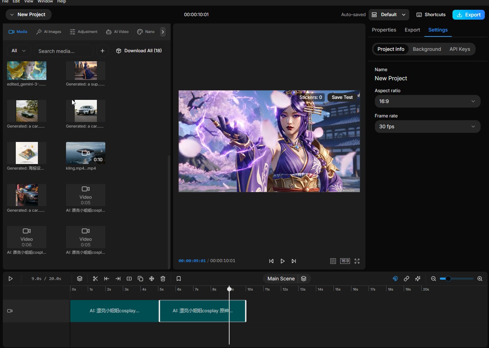

# AI Generated Video Missing Thumbnail

## Status: OPEN

**Created:** 2025-11-28

## Summary

AI-generated videos added to the media library display a generic video icon instead of an actual thumbnail preview. This makes it difficult to identify and distinguish between different generated videos at a glance.

## Screenshot



## Problem Description

When AI-generated videos are added to the media panel, some videos show:
- A generic camera/video icon
- Duration label (e.g., "0:05", "0:06", "0:10")
- No actual frame preview from the video content

This contrasts with other media items that correctly display thumbnail previews.

## Affected Items (from screenshot)

| Item | Has Thumbnail | Notes |
|------|---------------|-------|
| `kling.mp4...mp4` | Yes | Shows actual video frame |
| `AI: 漂亮小姐姐cospl...` (0:05) | No | Generic video icon |
| `AI: 漂亮小姐姐cospl...` (0:06) | No | Generic video icon |
| `AI: 漂亮小姐姐cospl...` (0:05) | No | Generic video icon |

## Root Cause Analysis

Based on console logs and code analysis:

### The Problem Flow

1. **AI video generation completes** (`use-ai-generation.ts`)
2. **Video is downloaded and saved to disk** (step 6e in logs)
3. **`addMediaItem()` is called** with the video file
4. **Item is added to state WITHOUT triggering thumbnail generation**
5. **Media panel renders item with `thumbnailUrl: undefined`**
6. **Fallback UI shows generic video icon** (`media.tsx:283-293`)

### Code Evidence

**Console log shows item added without thumbnail:**
```json
{
  "name": "AI: 漂亮小姐姐cosplay 原神...",
  "type": "video",
  "file": {},
  "url": "blob:app://./6895a720-6fe3-4e5b-a7fa-e48ccf8ca33a",
  "localPath": "C:\\Users\\...\\ai-videos\\AI-Video-veo31_text_to_video-....mp4",
  "isLocalFile": true,
  "duration": 5,
  "width": 1920,
  "height": 1080
}
```
Note: No `thumbnailUrl` or `thumbnailStatus` fields.

**`addMediaItem()` in `media-store.ts:379-487`:**
- Adds item to state immediately (line 436-438)
- Saves to persistent storage (line 442)
- **Does NOT call `extractVideoMetadataBackground()`** for thumbnail generation

**Thumbnail generation only happens in `loadProjectMedia()` (`media-store.ts:685-707`):**
```typescript
if (item.type === "video" && item.file) {
  if (item.thumbnailUrl) {
    // Use stored thumbnail
  } else {
    // Start background generation
    extractVideoMetadataBackground(item.file, item.id, projectId);
  }
}
```

This code path is only executed when **loading existing items from storage**, not when **adding new items**.

## Expected Behavior

All video files in the media library should display a thumbnail preview showing an actual frame from the video (typically the first frame).

---

## Implementation Plan

### Solution: Add thumbnail generation in `addMediaItem()` for videos

This fix ensures all videos get thumbnails regardless of how they're added (AI generation, manual upload, etc.).

### File to Modify

`apps/web/src/stores/media-store.ts`

### Implementation Details

**Location:** Inside `addMediaItem()` function, after adding to local state (after line 438) and before storage save.

**Current code (lines 435-442):**
```typescript
// Add to local state immediately for UI responsiveness
set((state) => ({
  mediaItems: [...state.mediaItems, newItem],
}));

// Save to persistent storage in background
try {
  await storageService.saveMediaItem(projectId, newItem);
```

**Updated code:**
```typescript
// Add to local state immediately for UI responsiveness
set((state) => ({
  mediaItems: [...state.mediaItems, newItem],
}));

// Trigger thumbnail generation for newly added videos
if (newItem.type === "video" && newItem.file && !newItem.thumbnailUrl) {
  // Set pending status immediately for UI feedback
  set((state) => ({
    mediaItems: state.mediaItems.map((media) =>
      media.id === newItem.id
        ? { ...media, thumbnailStatus: "pending" as const }
        : media
    ),
  }));

  // Start background thumbnail generation (async, doesn't block)
  extractVideoMetadataBackground(newItem.file, newItem.id, projectId);
}

// Save to persistent storage in background
try {
  await storageService.saveMediaItem(projectId, newItem);
```

### Why This Works

1. **`extractVideoMetadataBackground()`** already exists and handles:
   - Setting `thumbnailStatus: "loading"`
   - Generating thumbnail via browser APIs (`generateVideoThumbnailBrowser`)
   - Extracting video duration
   - Updating the media item with `thumbnailUrl` and `thumbnailStatus: "ready"`
   - Persisting the updated metadata to storage

2. **Non-blocking:** The function runs asynchronously, so UI remains responsive

3. **Consistent behavior:** Same thumbnail generation path used for both:
   - Newly added videos (via this fix)
   - Existing videos loaded from storage (existing code in `loadProjectMedia`)

### Edge Cases Handled

| Case | Handling |
|------|----------|
| Video already has `thumbnailUrl` | Skip generation (condition check) |
| No file attached | Skip generation (condition check) |
| Thumbnail generation fails | `extractVideoMetadataBackground` sets `thumbnailStatus: "failed"` |
| User adds multiple videos quickly | Each gets its own async generation |

---

## Review

- **High** – Race with storage persistence if thumbnail generation is started before the initial save: `extractVideoMetadataBackground` persists the updated item via `updateMediaMetadataAndPersist` (`qcut/apps/web/src/stores/media-store.ts:171`) while `addMediaItem` later awaits `storageService.saveMediaItem` (`qcut/apps/web/src/stores/media-store.ts:440`). If the background write finishes first, the subsequent save of the unmodified item can overwrite the generated thumbnail in storage, so it will be missing after reload. Kick off thumbnail generation only after the initial save resolves or ensure the post-generation persist happens after that write.
- **Medium** – Background job still runs when the initial save fails: if `saveMediaItem` rejects in `addMediaItem` (`qcut/apps/web/src/stores/media-store.ts:440-485`), the currently proposed placement would already have queued thumbnail generation, which would then persist metadata even though the add operation surfaced as failed. Gate the thumbnail job on a successful storage write or cancel it when the save fails to avoid inconsistent saved state vs. UI error handling.
- **Testing gap** – Add a regression that verifies thumbnails generated during `addMediaItem` survive a subsequent `loadProjectMedia` reload (`qcut/apps/web/src/stores/media-store.ts:663-731`), catching the persistence race described above.

## Testing Checklist

- [ ] Generate AI video with Veo 3.1 or other model
- [ ] Verify thumbnail appears in media panel after generation completes
- [ ] Verify "Loading..." spinner shows during thumbnail generation
- [ ] Verify thumbnail persists after page refresh
- [ ] Verify manually uploaded videos also get thumbnails immediately
- [ ] Verify no performance regression (thumbnail generation is async)
- [ ] Verify existing videos with thumbnails are not re-processed

## Priority

Medium - Affects user experience and media organization

## Related Files

| File | Purpose |
|------|---------|
| `apps/web/src/stores/media-store.ts` | Media store - `addMediaItem()` and `extractVideoMetadataBackground()` |
| `apps/web/src/components/editor/media-panel/views/media.tsx` | Media panel UI - `renderPreview()` handles thumbnail display |
| `apps/web/src/components/editor/media-panel/views/use-ai-generation.ts` | AI video generation hook - calls `addMediaItem()` |
| `apps/web/src/stores/media-store-types.ts` | Type definitions for `MediaItem`, `thumbnailStatus` |
