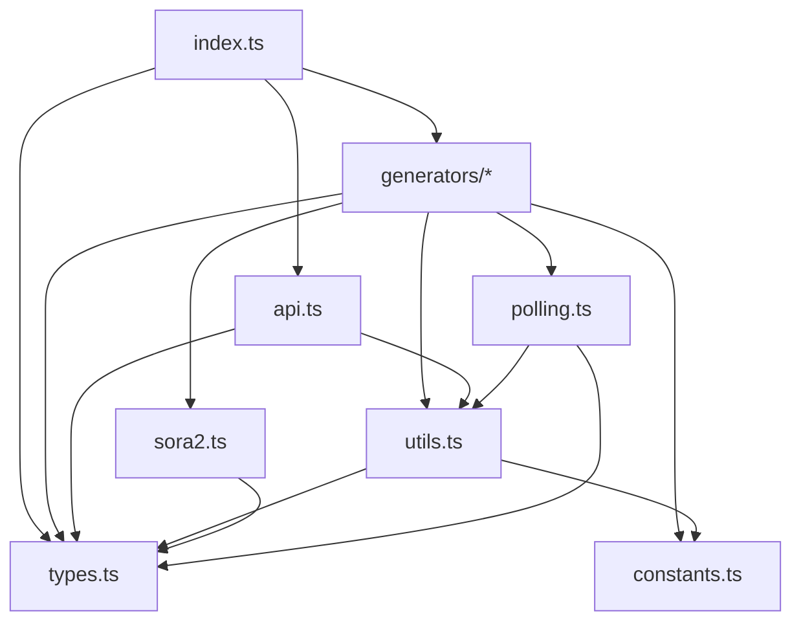

# AI Video Client Refactoring Plan

**File**: `qcut/apps/web/src/lib/ai-video-client.ts`
**Current Size**: 4035 lines
**Target**: Split into 6 focused modules with maximum code reuse

---

## Overview

The current `ai-video-client.ts` is a monolithic file containing all AI video generation logic. This refactoring will:
1. Improve maintainability by separating concerns
2. Enable better tree-shaking for smaller bundle sizes
3. Make testing individual components easier
4. Facilitate parallel development on different features

---

## Proposed File Structure

```
qcut/apps/web/src/lib/ai-video/
├── index.ts                    # Re-exports all public APIs (barrel file)
├── types.ts                    # All TypeScript interfaces and types (~150 lines)
├── constants.ts                # FAL_API_BASE, validation constants (~50 lines)
├── utils.ts                    # Shared utility functions (~200 lines)
├── sora2.ts                    # Sora 2 model-specific logic (~200 lines)
├── generators/
│   ├── index.ts                # Re-exports all generators
│   ├── text-to-video.ts        # generateVideo, generateVideoFromText, generateLTXV2Video (~500 lines)
│   ├── image-to-video.ts       # generateVideoFromImage, generateViduQ2Video, generateSeedanceVideo, etc. (~600 lines)
│   ├── avatar.ts               # generateAvatarVideo and related functions (~400 lines)
│   └── upscale.ts              # All upscaler functions (~250 lines)
├── polling.ts                  # Queue polling and status management (~200 lines)
└── api.ts                      # High-level API functions (getAvailableModels, estimateCost, etc.) (~100 lines)
```

---

## Subtasks

### Task 1: Create `types.ts` - Type Definitions (~150 lines)
**Priority**: HIGH (must be done first - all other files depend on this)

Move all TypeScript interfaces and types:
- `VideoGenerationRequest`
- `ImageToVideoRequest`
- `TextToVideoRequest`
- `ViduQ2I2VRequest`
- `LTXV2T2VRequest`
- `LTXV2I2VRequest`
- `AvatarVideoRequest`
- `VideoGenerationResponse`
- `GenerationStatus`
- `ModelsResponse`
- `CostEstimate`
- `ProgressCallback`
- `SeedanceI2VRequest`
- `KlingI2VRequest`
- `Kling26I2VRequest`
- `KlingO1V2VRequest`
- `KlingO1Ref2VideoRequest`
- `WAN25I2VRequest`
- `ByteDanceUpscaleRequest`
- `FlashVSRUpscaleRequest`
- `TopazUpscaleRequest`
- `Sora2BasePayload`
- `Sora2Payload`

**Reuse Strategy**: Import from centralized location in all other files.

---

### Task 2: Create `constants.ts` - Configuration Constants (~50 lines)
**Priority**: HIGH

Move configuration constants:
- `FAL_API_BASE`
- `LTXV2_STANDARD_T2V_DURATIONS`
- `LTXV2_FAST_T2V_DURATIONS`
- `LTXV2_STANDARD_I2V_DURATIONS`
- `LTXV2_STANDARD_I2V_RESOLUTIONS`
- `LTXV2_FAST_I2V_DURATIONS`
- `LTXV2_FAST_I2V_RESOLUTIONS`
- `LTXV2_FAST_EXTENDED_THRESHOLD`
- `LTXV2_FAST_EXTENDED_RESOLUTIONS`
- `LTXV2_FAST_EXTENDED_FPS`
- `LTXV2_FAST_I2V_FPS`

**Reuse Strategy**: All validation functions import from this file.

---

### Task 3: Create `utils.ts` - Shared Utilities (~200 lines)
**Priority**: HIGH

Move utility functions that are reused across generators:
- `getFalApiKey()` - API key retrieval
- `getModelConfig()` - Model configuration lookup
- `generateJobId()` - Unique ID generation
- `sleep()` - Polling sleep utility
- `fileToDataURL()` - File to base64 conversion
- `handleQueueError()` - Error message formatting
- `handleApiError()` - API error conversion
- `streamVideoDownload()` - Video streaming download

**Validation Helpers** (reused by multiple generators):
- `validateHailuo23Prompt()`
- `isHailuo23TextToVideo()`
- `validateViduQ2Prompt()`
- `validateViduQ2Duration()`
- `validateLTXV2Resolution()`
- `validateLTXV2T2VDuration()`
- `validateLTXV2I2VDuration()`
- `validateLTXV2I2VResolution()`
- `validateLTXV2FastExtendedConstraints()`
- `isFastLTXV2TextModel()`
- `isStandardLTXV2ImageModel()`
- `validateKlingAvatarV2Audio()`

**Reuse Strategy**: All generators import shared utilities from here.

---

### Task 4: Create `sora2.ts` - Sora 2 Model Logic (~200 lines)
**Priority**: MEDIUM

Move all Sora 2-specific logic:
- `isSora2Model()` - Model detection
- `getSora2ModelType()` - Get specific model type
- `convertSora2Parameters()` - Parameter conversion with exhaustiveness check
- `parseSora2Response()` - Response parsing with metadata extraction

**Reuse Strategy**: Text-to-video and image-to-video generators import Sora 2 helpers when needed.

---

### Task 5: Create `polling.ts` - Queue Polling Logic (~200 lines)
**Priority**: MEDIUM

Move polling-related functions:
- `pollQueueStatus()` - Main polling loop
- `mapQueueStatusToProgress()` - Status mapping

**Reuse Strategy**: Text-to-video generator imports polling for queue mode.

---

### Task 6: Create `generators/text-to-video.ts` (~500 lines)
**Priority**: HIGH

Move text-to-video generation functions:
- `generateVideo()` - Main text-to-video with queue support
- `generateVideoFromText()` - Hailuo 2.3 text-to-video
- `generateLTXV2Video()` - LTX Video 2.0 text-to-video

**Dependencies**:
- `types.ts`
- `constants.ts`
- `utils.ts`
- `sora2.ts`
- `polling.ts`

**Reuse Strategy**:
- All three functions share `getFalApiKey()`, `getModelConfig()`, `generateJobId()`, and error handling
- `generateVideo()` and `generateLTXV2Video()` share Sora 2 handling code

---

### Task 7: Create `generators/image-to-video.ts` (~600 lines)
**Priority**: HIGH

Move image-to-video generation functions:
- `generateVideoFromImage()` - Generic image-to-video
- `generateViduQ2Video()` - Vidu Q2 Turbo I2V
- `generateLTXV2ImageVideo()` - LTX Video 2.0 I2V
- `generateSeedanceVideo()` - Seedance I2V
- `generateKlingImageVideo()` - Kling v2.5 Turbo Pro I2V
- `generateKling26ImageVideo()` - Kling v2.6 Pro I2V
- `generateKlingO1Video()` - Kling O1 video-to-video
- `generateKlingO1RefVideo()` - Kling O1 reference-to-video
- `generateWAN25ImageVideo()` - WAN 2.5 Preview I2V

**Dependencies**:
- `types.ts`
- `constants.ts`
- `utils.ts`
- `sora2.ts`

**Reuse Strategy**:
- All functions share: `getFalApiKey()`, `getModelConfig()`, `generateJobId()`, `fileToDataURL()`
- Common error handling pattern with `handleAIServiceError()`
- Similar payload building pattern (spread default_params, then override)

**Extraction of Common Patterns**:
```typescript
// New helper in utils.ts
async function makeGenerationRequest<T extends VideoGenerationResponse>(
  endpoint: string,
  payload: Record<string, unknown>,
  modelId: string,
  operationName: string
): Promise<T> {
  const falApiKey = getFalApiKey();
  if (!falApiKey) throw new Error("FAL API key not configured");

  const jobId = generateJobId();
  const response = await fetch(`${FAL_API_BASE}/${endpoint}`, {
    method: "POST",
    headers: {
      Authorization: `Key ${falApiKey}`,
      "Content-Type": "application/json",
    },
    body: JSON.stringify(payload),
  });

  if (!response.ok) {
    return handleFalApiError(response, operationName);
  }

  const result = await response.json();
  return {
    job_id: jobId,
    status: "completed",
    message: `Video generated successfully with ${modelId}`,
    estimated_time: 0,
    video_url: result.video?.url || result.video || result.url,
    video_data: result,
  } as T;
}
```

---

### Task 8: Create `generators/avatar.ts` (~400 lines)
**Priority**: MEDIUM

Move avatar generation functions:
- `generateAvatarVideo()` - Main avatar video generation

This function handles multiple models:
- Kling Avatar Pro/Standard
- Kling Avatar v2 Standard/Pro
- ByteDance OmniHuman v1.5
- WAN Animate/Replace
- Kling O1 Reference-to-Video

**Dependencies**:
- `types.ts`
- `utils.ts`

**Reuse Strategy**:
- All model-specific branches share common setup (API key check, model config lookup)
- Shares `fileToDataURL()` for image/audio conversion

---

### Task 9: Create `generators/upscale.ts` (~250 lines)
**Priority**: LOW

Move upscaling functions:
- `upscaleByteDanceVideo()` - ByteDance video upscaler
- `upscaleFlashVSRVideo()` - FlashVSR video upscaler
- `upscaleTopazVideo()` - Topaz video upscaler (not implemented)

**Dependencies**:
- `types.ts`
- `utils.ts`

**Reuse Strategy**:
- All upscalers share identical API call pattern
- Extract common `makeUpscaleRequest()` helper

---

### Task 10: Create `api.ts` - High-Level API Functions (~100 lines)
**Priority**: LOW

Move API utility functions:
- `isApiAvailable()` - Check if API key is configured
- `getAvailableModels()` - Get all available models
- `estimateCost()` - Estimate generation cost
- `getGenerationStatus()` - Get job status (mock for compatibility)

**Dependencies**:
- `types.ts`
- `utils.ts`

---

### Task 11: Create `generators/image.ts` - Image Generation (~150 lines)
**Priority**: LOW

Move image generation functions (Seeddream 4.5):
- `generateSeeddream45Image()` - Text-to-image
- `editSeeddream45Image()` - Image editing
- `uploadImageForSeeddream45Edit()` - Image upload for editing

**Dependencies**:
- `types.ts`
- `utils.ts`

---

### Task 12: Create `index.ts` - Barrel File
**Priority**: FINAL (after all other tasks)

Create barrel file that re-exports all public APIs for backward compatibility:

```typescript
// Types
export type {
  VideoGenerationRequest,
  ImageToVideoRequest,
  TextToVideoRequest,
  // ... all other types
} from './types';

// Generators - Text to Video
export { generateVideo } from './generators/text-to-video';
export { generateVideoFromText } from './generators/text-to-video';
export { generateLTXV2Video } from './generators/text-to-video';

// Generators - Image to Video
export { generateVideoFromImage } from './generators/image-to-video';
export { generateViduQ2Video } from './generators/image-to-video';
// ... all other exports

// API
export { isApiAvailable, getAvailableModels, estimateCost, getGenerationStatus } from './api';

// Utils (if needed externally)
export { handleApiError } from './utils';
```

---

### Task 13: Update Imports in Consuming Files
**Priority**: FINAL

Update all files that import from `ai-video-client.ts`:
1. Search for `from "@/lib/ai-video-client"` or `from "./ai-video-client"`
2. Update to `from "@/lib/ai-video"` (will use barrel file)
3. No functional changes needed - barrel file maintains API compatibility

---

## Code Reuse Patterns

### Pattern 1: Common Request Handler
Extract the repeated FAL API request pattern:

```typescript
// utils.ts
export async function executeFalRequest(
  endpoint: string,
  payload: Record<string, unknown>,
  options?: {
    timeout?: number;
    signal?: AbortSignal;
  }
): Promise<Response> {
  const falApiKey = getFalApiKey();
  if (!falApiKey) throw new Error("FAL API key not configured");

  return fetch(`${FAL_API_BASE}/${endpoint}`, {
    method: "POST",
    headers: {
      Authorization: `Key ${falApiKey}`,
      "Content-Type": "application/json",
    },
    body: JSON.stringify(payload),
    signal: options?.signal,
  });
}
```

### Pattern 2: Common Error Handler
Extract the repeated error handling pattern:

```typescript
// utils.ts
export async function handleFalResponse(
  response: Response,
  operationName: string
): Promise<void> {
  if (response.ok) return;

  const errorData = await response.json().catch(() => ({}));

  if (response.status === 401) {
    throw new Error("Invalid FAL.ai API key. Please check your API key configuration.");
  }

  if (response.status === 429) {
    throw new Error("Rate limit exceeded. Please wait a moment before trying again.");
  }

  throw new Error(`FAL API error: ${errorData.detail || response.statusText}`);
}
```

### Pattern 3: Common Response Builder
Extract the repeated response building pattern:

```typescript
// utils.ts
export function buildVideoResponse(
  jobId: string,
  modelId: string,
  result: any
): VideoGenerationResponse {
  return {
    job_id: jobId,
    status: "completed",
    message: `Video generated successfully with ${modelId}`,
    estimated_time: 0,
    video_url: result.video?.url || result.video || result.url,
    video_data: result,
  };
}
```

---

## Testing Strategy

1. **Unit Tests**: Each new file gets its own test file in `__tests__/`
2. **Integration Tests**: Test the barrel file exports work correctly
3. **Regression Tests**: Ensure all existing functionality works after refactoring

---

## Migration Path

1. **Phase 1**: Create new files with extracted code (Tasks 1-11)
2. **Phase 2**: Create barrel file (Task 12)
3. **Phase 3**: Update imports in consuming files (Task 13)
4. **Phase 4**: Delete original `ai-video-client.ts`
5. **Phase 5**: Run full test suite to verify no regressions

---

## Estimated Line Counts

| File | Lines | Description |
|------|-------|-------------|
| `types.ts` | ~150 | All TypeScript interfaces |
| `constants.ts` | ~50 | Configuration constants |
| `utils.ts` | ~200 | Shared utilities |
| `sora2.ts` | ~200 | Sora 2 specific logic |
| `polling.ts` | ~200 | Queue polling logic |
| `generators/text-to-video.ts` | ~500 | Text-to-video generators |
| `generators/image-to-video.ts` | ~600 | Image-to-video generators |
| `generators/avatar.ts` | ~400 | Avatar generation |
| `generators/upscale.ts` | ~250 | Video upscaling |
| `generators/image.ts` | ~150 | Image generation (Seeddream) |
| `api.ts` | ~100 | High-level API functions |
| `index.ts` | ~50 | Barrel file |
| **Total** | **~2,850** | ~30% reduction from original |

The ~30% reduction comes from:
- Eliminating duplicated error handling code
- Extracting common request/response patterns
- Removing redundant comments (consolidated in one place)
- More efficient organization

---

## Dependencies



---

## Risk Mitigation

1. **Circular Dependencies**: Carefully order imports to avoid circular deps
2. **Tree-Shaking Issues**: Use named exports, not default exports
3. **Type Inference**: Ensure TypeScript can still infer types correctly
4. **Bundle Size**: Monitor bundle size before/after to ensure improvement

---

## Success Criteria

- [ ] All existing tests pass
- [ ] No new TypeScript errors
- [ ] Bundle size reduced or unchanged
- [ ] All consuming files updated without breaking changes
- [ ] Each file under 600 lines
- [ ] Clear separation of concerns
