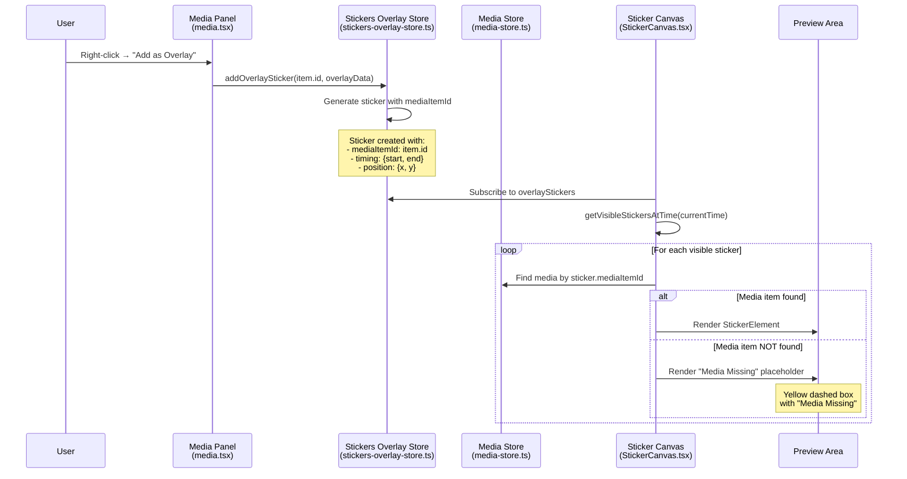
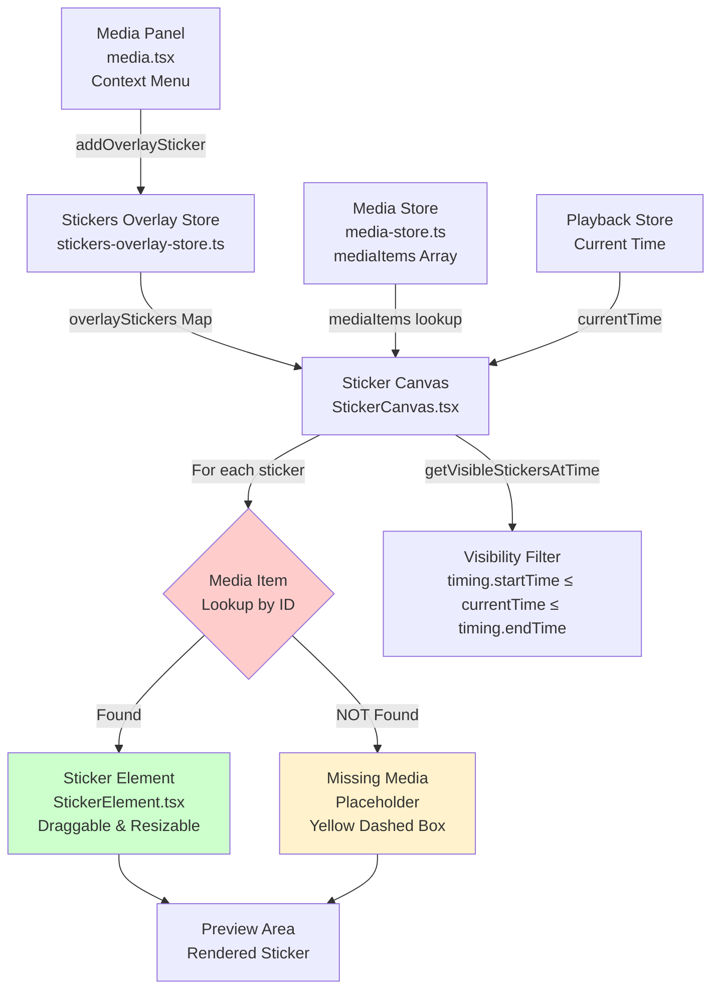

# Overlay to Preview: Sticker Not Appearing in Timeline

## Issue Description
When using the "Add as Overlay" context menu option from the media panel to add media items as overlay stickers, the stickers are successfully added to the overlay store but are not visible in the preview area due to mediaItemId matching issues.

## Expected Behavior
1. Right-click on a media item (image or video) in the media panel
2. Select "Add as Overlay" from the context menu
3. Sticker should appear in the preview/canvas area at the current playback position
4. Sticker should be visible and interactive (draggable, resizable)

## Current Behavior
- The "Add as Overlay" context menu action executes successfully
- Sticker is added to the `stickers-overlay-store` 
- Debug logs show: `totalStickers: 1, visibleStickers: 1`
- However, sticker shows "Media Missing" placeholder instead of actual content
- Root cause: MediaItemId mismatch between sticker and media store

## Technical Analysis

### Store Flow
The sticker creation process works correctly:
1. ✅ User clicks "Add as Overlay" 
2. ✅ `addOverlaySticker()` is called with correct mediaItemId
3. ✅ Sticker is added to overlay store with timing and position
4. ✅ `StickerCanvas` detects the new sticker
5. ❌ `StickerCanvas` can't find matching media item by ID

### MediaItemId Lookup Issue
```typescript
// In StickerCanvas.tsx
const mediaItem = mediaItems.find(
  (item) => item.id === sticker.mediaItemId
);
// This lookup fails, causing "Media Missing" placeholder
```

## Architecture Diagrams

### 1. Sticker Creation Flow



### 2. Component Architecture



## Code Locations

### Core Files
- **Context Menu**: `qcut/apps/web/src/components/editor/media-panel/views/media.tsx:389-429`
- **Overlay Store**: `qcut/apps/web/src/stores/stickers-overlay-store.ts:119-144`  
- **Sticker Rendering**: `qcut/apps/web/src/components/editor/stickers-overlay/StickerCanvas.tsx:264-299`
- **Media Store**: `qcut/apps/web/src/stores/media-store.ts:264-311`

### Key Functions
```typescript
// 1. Trigger (media.tsx)
addOverlaySticker(item.id, overlayData)

// 2. Store (stickers-overlay-store.ts)  
addOverlaySticker: (mediaItemId: string, options = {}) => { /* ... */ }

// 3. Rendering (StickerCanvas.tsx)
const mediaItem = mediaItems.find(item => item.id === sticker.mediaItemId)
```

## Debug Information Added

Enhanced logging in `StickerCanvas.tsx` to diagnose the mediaItemId mismatch:

```typescript
console.error(
  `[StickerCanvas] ⚠️ MEDIA MISSING: Media item not found for sticker ${sticker.id}, mediaItemId: ${sticker.mediaItemId}`,
  {
    stickerMediaId: sticker.mediaItemId,
    availableMediaIds: mediaItems.map(m => ({ id: m.id, name: m.name })),
    sticker
  }
);
```

## Investigation Steps

1. **Check for Yellow Placeholder**: Look for yellow dashed border box in preview area
2. **Console Error Analysis**: Check browser console for mediaItemId mismatch details
3. **ID Generation**: Verify `generateFileBasedId()` consistency between stores
4. **Timing Issues**: Check if media items are loaded when sticker is created

## Potential Solutions

1. **ID Consistency**: Ensure same ID generation method across stores
2. **Async Handling**: Add retry mechanism for missing media items  
3. **Store Synchronization**: Improve media store loading before sticker creation
4. **Fallback Handling**: Better error recovery when media lookup fails

## Severity
**High** - Core overlay functionality broken due to store synchronization issue

## Status
**In Progress** - Root cause identified (mediaItemId mismatch), solution in development

## Last Updated
August 22, 2025