# AI Video Generation - Local Save & Media Panel Integration Issue

## Video Generation Flow Architecture

```mermaid
graph TD
    A[User clicks Generate in AI View] --> B[ai.tsx: Button onClick]
    B --> C[useAIGeneration.handleGenerate]
    C --> D[Validation: prompt, models, project]
    D --> E[Loop through selectedModels]

    E --> F[ai-video-client.generateVideo]
    F --> G[FAL.ai API Request]
    G --> H[FAL.ai Response with video_url]

    H --> I[✅ Video URL received]
    I --> J[useAIGeneration: Media Integration]

    J --> K[Download video from FAL URL]
    K --> L[Create File object from blob]
    L --> M[Call addMediaItem via useAsyncMediaStoreActions]

    M --> N[media-store.addMediaItem]
    N --> O[Generate UUID for media item]
    O --> P[Add to local state: mediaItems array]
    P --> Q[Save to storage: storageService.saveMediaItem]

    Q --> R[✅ Video appears in Media Panel]

    style I fill:#90EE90
    style R fill:#90EE90
    style J fill:#FFB6C1
    style K fill:#FFB6C1
    style L fill:#FFB6C1
    style M fill:#FFB6C1
```



## Previous Issue Summary

The initial problem was a FAL.ai account access issue (422 error) which has been **RESOLVED**. Video generation is now working successfully and FAL.ai returns video URLs properly.

## Current Problem Summary

The AI video generation completes successfully and receives video URLs from FAL.ai, but **generated videos are not being saved locally or added to the media panel**. Videos generate correctly but don't appear in the project's media library for use.

## Step-by-Step Function Call Analysis

### ✅ Working Flow (From Prompt to Video URL)

1. **User Interaction** (`ai.tsx`)
   ```typescript
   // User clicks "Generate" button
   onClick={handleGenerate} // Line ~300
   ```

2. **Generation Hook** (`use-ai-generation.ts:403`)
   ```typescript
   const handleGenerate = useCallback(async () => {
     console.log("🚀🚀🚀 handleGenerate CALLED 🚀🚀🚀");
     // Validation passed, starting generation...
   ```

3. **Model Processing Loop** (`use-ai-generation.ts:438`)
   ```typescript
   for (const modelId of selectedModels) {
     console.log(`🎬 [${index + 1}/${selectedModels.length}] Processing model: ${modelId}`);
     const response = await generateVideo(request);
   ```

4. **FAL.ai API Client** (`ai-video-client.ts:115`)
   ```typescript
   console.log("🎬 Generating video with FAL AI:", endpoint);
   const response = await fetch(`${FAL_API_BASE}/${endpoint}`, { ... });
   ```

5. **Direct Mode Response** (`ai-video-client.ts:235`)
   ```typescript
   console.log("⚡ Direct mode: video ready immediately");
   return {
     job_id: generateJobId(),
     video_url: videoData.video.url, // ✅ SUCCESS: URL returned
   }
   ```

### ❌ Broken Flow (From Video URL to Media Panel)

6. **Media Integration** (`use-ai-generation.ts:540`) **← PROBLEM AREA**
   ```typescript
   if (activeProject && addMediaItem) {
     console.log("🔄 Attempting to add to media store...");
     // Download video from URL
     const videoResponse = await fetch(response.video_url);
     const blob = await videoResponse.blob();
     const file = new File([blob], `ai-video-${modelId}.mp4`);

     // Add to media store
     const newItemId = await addMediaItem(activeProject.id, mediaItem);
   }
   ```

7. **Async Media Store Hook** (`use-async-media-store.ts:92`)
   ```typescript
   return {
     addMediaItem: store?.addMediaItem, // May return undefined if store not loaded
   }
   ```

8. **Media Store Action** (`media-store.ts:324`)
   ```typescript
   addMediaItem: async (projectId, item) => {
     const newItem: MediaItem = { ...item, id };
     set(state => ({ mediaItems: [...state.mediaItems, newItem] }));
     await storageService.saveMediaItem(projectId, newItem);
   }
   ```

## Current Issue Analysis

### Success Confirmation (Working)
From video-console_v2.md logs:
- ✅ FAL API generation successful
- ✅ Video URL received: `https://v3.fal.media/files/penguin/7H2_BK25ykTLu6KiXC3YY.mp4`
- ✅ Video metadata received (1920x1080, 5.042s duration, 121 frames)
- ✅ onComplete callback executed successfully
- ✅ Generation marked as completed with 100% progress

### Missing Integration (Problem)
- ❌ Video not downloaded to local filesystem
- ❌ Video not added to media panel/library
- ❌ Video not available for use in timeline

### Code Flow Analysis
From the console logs, the flow stops after `onComplete` callback:

```javascript
use-ai-generation.ts:607 📤 Calling onComplete callback with 1 videos
ai.tsx:79 🎉🎉🎉 [AI View] GENERATION COMPLETE 🎉🎉🎉
ai.tsx:80 [AI View] Received 1 videos: [{…}]
ai.tsx:85 [AI View] onComplete callback finished
use-ai-generation.ts:609 ✅ onComplete callback finished
```

**Missing**: No logs showing video download or media store integration.

## Root Cause Analysis

Based on code investigation, the media integration workflow **IS IMPLEMENTED** but may have execution issues. The problem is likely:

### ✅ Implementation Status
- **Video Download**: ✅ Implemented in `use-ai-generation.ts:546-568`
- **Media Store Integration**: ✅ Implemented using `addMediaItem` function
- **File Creation**: ✅ Creates File object from downloaded blob
- **Media Item Structure**: ✅ Proper MediaItem object with metadata

### ❌ Potential Failure Points

1. **Async Media Store Loading**
   - `addMediaItem` may be `undefined` if store hasn't loaded yet
   - Race condition: generation completes before media store initializes

2. **Error Handling**
   - Fetch/download errors are caught but may fail silently
   - Storage errors may prevent media item persistence

3. **Project State**
   - `activeProject` may be null/undefined at time of media addition
   - Project ID not properly passed through the chain

### 🔍 Missing from Console Logs
The console logs from video-console_v2.md show generation success but **no logs from media integration code**:

```
✅ Present: "GENERATION COMPLETE", "onComplete callback finished"
❌ Missing: "Attempting to add to media store...", "VIDEO SUCCESSFULLY ADDED"
```

This suggests the media integration code block (`use-ai-generation.ts:540-594`) **is not executing at all**.

## Solutions Required

### Immediate Debug Steps - Sequential Console Logging

Add these numbered debug logs to quickly identify where the flow breaks:

**Step 1: Pre-Generation Debug** (Add at `use-ai-generation.ts:440`)
```typescript
console.log("🔍 DEBUG STEP 1: Pre-Generation State Check");
console.log("   - activeProject:", !!activeProject, activeProject?.id);
console.log("   - addMediaItem available:", !!addMediaItem, typeof addMediaItem);
console.log("   - mediaStoreLoading:", mediaStoreLoading);
console.log("   - mediaStoreError:", mediaStoreError);
```

**Step 2: Post-API Response Debug** (Add at `use-ai-generation.ts:475` after generateVideo call)
```typescript
console.log("🔍 DEBUG STEP 2: Post-API Response Analysis");
console.log("   - response received:", !!response);
console.log("   - response.video_url:", !!response.video_url, response.video_url?.substring(0, 50) + "...");
console.log("   - response.job_id:", !!response.job_id, response.job_id);
console.log("   - response keys:", Object.keys(response));
console.log("   - response.status:", response.status);
```

**Step 3: Media Integration Condition Debug** (Add at `use-ai-generation.ts:540` BEFORE the if statement)
```typescript
console.log("🔍 DEBUG STEP 3: Media Integration Condition Check");
console.log("   - activeProject check:", !!activeProject, "→", activeProject?.id);
console.log("   - addMediaItem check:", !!addMediaItem, "→", typeof addMediaItem);
console.log("   - response.video_url check:", !!response.video_url, "→", !!response.video_url ? "EXISTS" : "MISSING");
console.log("   - WILL EXECUTE MEDIA INTEGRATION:", !!(activeProject && addMediaItem && response.video_url));
```

**Step 4: Inside Media Integration Block** (Add at `use-ai-generation.ts:541` INSIDE the if statement)
```typescript
console.log("🔍 DEBUG STEP 4: ✅ EXECUTING Media Integration Block");
console.log("   - About to download from URL:", response.video_url);
console.log("   - Project ID for media:", activeProject.id);
console.log("   - addMediaItem function type:", typeof addMediaItem);
```

**Step 5: Video Download Debug** (Add at `use-ai-generation.ts:547` after fetch)
```typescript
console.log("🔍 DEBUG STEP 5: Video Download Progress");
console.log("   - videoResponse.ok:", videoResponse.ok);
console.log("   - videoResponse.status:", videoResponse.status);
console.log("   - videoResponse.headers content-type:", videoResponse.headers.get('content-type'));
```

**Step 6: File Creation Debug** (Add at `use-ai-generation.ts:552` after File creation)
```typescript
console.log("🔍 DEBUG STEP 6: File Creation Complete");
console.log("   - blob.size:", blob.size, "bytes");
console.log("   - blob.type:", blob.type);
console.log("   - file.name:", file.name);
console.log("   - file.size:", file.size);
```

**Step 7: Media Store Call Debug** (Add at `use-ai-generation.ts:573` before addMediaItem call)
```typescript
console.log("🔍 DEBUG STEP 7: About to Call addMediaItem");
console.log("   - mediaItem structure:", JSON.stringify(mediaItem, null, 2));
console.log("   - projectId:", activeProject.id);
console.log("   - addMediaItem is function:", typeof addMediaItem === 'function');
```

**Step 8: Success/Error Debug** (Add at `use-ai-generation.ts:575` after addMediaItem call)
```typescript
console.log("🔍 DEBUG STEP 8: ✅ addMediaItem COMPLETED");
console.log("   - newItemId:", newItemId);
console.log("   - SUCCESS: Video added to media store!");
```

### Likely Root Causes (In Priority Order)

1. **Media Store Not Loaded** (Most Likely)
   - `useAsyncMediaStoreActions()` returns `addMediaItem: undefined`
   - Store loading race condition with video generation completion

2. **Response Structure Mismatch**
   - Code expects `video_url` field but gets different structure
   - Condition `if (response.video_url)` fails despite URL being present

3. **Project State Issue**
   - `activeProject` is null/undefined at execution time
   - Project context lost during async generation

### Expected vs Actual Debug Output

**With Step-by-Step Debugging, you should see:**

✅ **If Working Properly:**
```
🔍 DEBUG STEP 1: Pre-Generation State Check
   - activeProject: true project-123
   - addMediaItem available: true function
🔍 DEBUG STEP 2: Post-API Response Analysis
   - response.video_url: true https://v3.fal.media/files/penguin/...
🔍 DEBUG STEP 3: Media Integration Condition Check
   - WILL EXECUTE MEDIA INTEGRATION: true
🔍 DEBUG STEP 4: ✅ EXECUTING Media Integration Block
🔍 DEBUG STEP 5: Video Download Progress
🔍 DEBUG STEP 6: File Creation Complete
🔍 DEBUG STEP 7: About to Call addMediaItem
🔍 DEBUG STEP 8: ✅ addMediaItem COMPLETED
```

❌ **Current Issue - Will Show Where It Stops:**
```
🔍 DEBUG STEP 1: Pre-Generation State Check ✅
🔍 DEBUG STEP 2: Post-API Response Analysis ✅
🔍 DEBUG STEP 3: Media Integration Condition Check
   - WILL EXECUTE MEDIA INTEGRATION: false ❌ (STOPS HERE)
```

**Quick Problem Identification:**
- **Stops at Step 1**: Media store loading issue
- **Stops at Step 3**: Condition check failure (most likely)
- **Stops at Step 5**: Video download failure
- **Stops at Step 7**: Media store call failure

## Latest Test Results Analysis (video-console-v3.md)

### ✅ Confirmed Working Steps
From the updated console output:
- **Step 1**: ✅ Pre-Generation State Check (Lines 12-16)
  - `activeProject: true 4769ffd3-cbcf-4329-b2bf-3cd5135d9bcf` ✅
  - `addMediaItem available: true function` ✅
  - `mediaStoreLoading: false` ✅
  - `mediaStoreError: null` ✅
- **Step 2**: ✅ Post-API Response Analysis (Lines 38-43)
  - `response received: true` ✅
  - `response.video_url: true https://v3b.fal.media/files/b/monkey/zh1VdIX0nKbWn...` ✅
  - Response structure: All expected fields present ✅

### ❌ CRITICAL FINDING: Missing Debug Steps
**Present from console:**
- ✅ **Step 1**: Pre-generation state shows ALL conditions are met
- ✅ **Step 2**: Response analysis shows video_url exists

**Missing from console output:**
- ❌ **Step 3**: Media integration condition check (**CRITICAL** - This should appear but doesn't)
- ❌ **Steps 4-8**: All media integration execution steps

### 🔍 Root Cause Identified
**All prerequisites are met:**
- ✅ `activeProject` exists with valid ID
- ✅ `addMediaItem` is available as function
- ✅ `response.video_url` exists with valid URL

**But Step 3 conditional check debug logs NEVER APPEAR**, which means the media integration code block is **NOT in the execution path** after the generateVideo response.

### Key Evidence Analysis:
```
✅ Step 1: All conditions met (activeProject=true, addMediaItem=function, video_url=exists)
✅ Step 2: Response received with valid video_url
❌ Step 3: NEVER REACHED - Media integration condition check missing
❌ Steps 4-8: NEVER REACHED - Media integration execution missing
```

**This confirms**: The media integration code is **NOT executed in the current code path** despite all conditions being satisfied.

## Implementation Plan

### **Option 1: Handle Direct Mode in job_id Branch (Recommended)**
Since the response has both `job_id` AND `video_url`, modify the `if (response?.job_id)` branch to check for immediate video availability:

```typescript
if (response?.job_id) {
  if (response?.video_url) {
    // Direct mode with job_id: video is ready immediately
    console.log("🎯 DIRECT MODE WITH JOB_ID - Video URL:", response.video_url);

    // ADD MEDIA INTEGRATION HERE (move Steps 3-8 to this location)
    const newVideo: GeneratedVideo = { /* create video object */ };
    generations.push({ modelId, video: newVideo });

    // Media store integration (Steps 3-8)
    if (activeProject && addMediaItem) {
      // Download and add to media store
    }
  } else {
    // Traditional polling mode: no video_url yet
    startStatusPolling(response.job_id);
  }
}
```

### **Option 2: Change Conditional Logic**
Prioritize `video_url` over `job_id` by switching the order:

```typescript
if (response?.video_url) {
  // Direct mode: video ready immediately (EXISTING MEDIA INTEGRATION)
  // This path will now execute
} else if (response?.job_id) {
  // Polling mode: video not ready yet
  startStatusPolling(response.job_id);
}
```

## ✅ **OPTION 1 FIX IMPLEMENTED**

### **Changes Made**
- ✅ Modified `if (response?.job_id)` branch to check for nested `video_url`
- ✅ Moved media integration Steps 3-8 to the correct execution path
- ✅ Added comprehensive console verification messages
- ✅ TypeScript compilation successful

### **New Console Verification Messages**
When testing the fix, you should now see:

```
🔍 FIX VERIFICATION: Processing job_id response
   - job_id exists: true
   - video_url exists: true
🎉 FIX SUCCESS: Direct mode with job_id detected!
🎯 DIRECT MODE WITH JOB_ID - Video URL: https://...
🔍 DEBUG STEP 3: Media Integration Condition Check
🔍 DEBUG STEP 4: ✅ EXECUTING Media Integration Block
🔍 DEBUG STEP 5: Video Download Progress
🔍 DEBUG STEP 6: File Creation Complete
🔍 DEBUG STEP 7: About to Call addMediaItem
🔍 DEBUG STEP 8: ✅ addMediaItem COMPLETED
✅ VIDEO SUCCESSFULLY ADDED TO MEDIA STORE!
```

### **Fix Verification**
- ❌ **Before**: Steps 3-8 never appeared (unreachable code)
- ✅ **After**: Should see "FIX SUCCESS" message followed by all Steps 3-8

## 🎉 **SUCCESS - ISSUE COMPLETELY RESOLVED!**

### **✅ Fix Verification Results (video-console-v3.md)**

**PERFECT EXECUTION - All Steps Working:**
```
🔍 FIX VERIFICATION: Processing job_id response ✅
🎉 FIX SUCCESS: Direct mode with job_id detected! ✅
🔍 DEBUG STEP 3: Media Integration Condition Check ✅
🔍 DEBUG STEP 4: ✅ EXECUTING Media Integration Block ✅
🔍 DEBUG STEP 5: Video Download Progress (6.5MB downloaded) ✅
🔍 DEBUG STEP 6: File Creation Complete ✅
🔍 DEBUG STEP 7: About to Call addMediaItem ✅
🔍 DEBUG STEP 8: ✅ addMediaItem COMPLETED ✅
✅ VIDEO SUCCESSFULLY ADDED TO MEDIA STORE! ✅
```

**Media Integration Working:**
- ✅ **Video ID**: `adccf745-e982-eb92-5472-e23be9570fa9`
- ✅ **File Size**: 6,544,052 bytes (6.5MB)
- ✅ **Media Store**: Successfully added
- ✅ **Timeline Integration**: Video appears and can be dragged to timeline
- ✅ **Media Count**: Shows `mediaItemsCount: 2` (videos are accumulating)

### **Remaining Issue: Content Security Policy**

**Minor Issue Identified (Lines 140-143, 353-356):**
```
Refused to load media from 'https://v3.fal.media/files/elephant/...' because it violates the following Content Security Policy directive: "media-src 'self' blob: data: app: https://freesound.org https://cdn.freesound.org".
```

**This is a separate issue** - the **media integration is 100% working**, but video playback is blocked by CSP policy.

## Status

**Priority**: ✅ **RESOLVED** - Main issue completely fixed
**Type**: **SUCCESS** - Media integration working perfectly
**Root Cause**: **FIXED** - Option 1 implementation successful
**Next Step**: **Optional** - Fix CSP policy to allow FAL.ai domain for video playback

## Final Summary

🎯 **MISSION ACCOMPLISHED**: Generated AI videos now successfully appear in the media panel and can be used in the timeline. The core video generation → media integration workflow is **100% functional**.

## Updated Key Findings

✅ **Video Generation**: Working perfectly (FAL.ai API, direct mode, URL return)
✅ **Prerequisites Met**: activeProject exists, addMediaItem available, video_url present
✅ **Debug Implementation**: Steps 1-2 working correctly
❌ **Execution Path**: Media integration code (Steps 3-8) never reached in current flow
❌ **Media Integration**: Code exists but not executed after successful generation

## Critical Discovery & Root Cause Found

### 🚨 **EXECUTION PATH ISSUE IDENTIFIED**

**Problem**: The media integration code (Steps 3-8) is placed in the **WRONG CONDITIONAL BRANCH**

**Code Analysis** (use-ai-generation.ts:510-534):
```typescript
if (response?.job_id) {
  // ✅ THIS PATH EXECUTES (because job_id exists)
  // Polling mode - no media integration here
  startStatusPolling(response.job_id);

} else if (response?.video_url) {
  // ❌ THIS PATH NEVER REACHED (our media integration is here)
  console.log("🎯 DIRECT MODE TRIGGERED - Video URL:", response.video_url);
  // Media integration Steps 3-8 are here but never execute
}
```

**From console logs**:
- `response.job_id: true job_nixbtstmx_1758780734496` ✅
- `response.video_url: true https://v3b.fal.media/files/b/monkey/...` ✅

**Since BOTH `job_id` AND `video_url` exist, the code takes the FIRST condition (`if job_id`) and NEVER reaches the `else if (video_url)` where our media integration is located.**

### 🎯 **The Fix Plan**

The media integration code needs to be moved to handle **BOTH cases**:

1. **Direct mode**: `video_url` exists immediately → Download and add to media store
2. **Polling mode**: `job_id` exists → Wait for completion, then download and add to media store

**Current Issue**: Media integration only exists in the `else if (video_url)` branch, but the response has both fields, so it goes to the `if (job_id)` branch instead.