# AI Video Generation - Local Save & Media Panel Integration Issue

## Video Generation Flow Architecture

```mermaid
graph TD
    A[User clicks Generate in AI View] --> B[ai.tsx: Button onClick]
    B --> C[useAIGeneration.handleGenerate]
    C --> D[Validation: prompt, models, project]
    D --> E[Loop through selectedModels]

    E --> F[ai-video-client.generateVideo]
    F --> G[FAL.ai API Request]
    G --> H[FAL.ai Response with video_url]

    H --> I[✅ Video URL received]
    I --> J[useAIGeneration: Media Integration]

    J --> K[Download video from FAL URL]
    K --> L[Create File object from blob]
    L --> M[Call addMediaItem via useAsyncMediaStoreActions]

    M --> N[media-store.addMediaItem]
    N --> O[Generate UUID for media item]
    O --> P[Add to local state: mediaItems array]
    P --> Q[Save to storage: storageService.saveMediaItem]

    Q --> R[✅ Video appears in Media Panel]

    style I fill:#90EE90
    style R fill:#90EE90
    style J fill:#FFB6C1
    style K fill:#FFB6C1
    style L fill:#FFB6C1
    style M fill:#FFB6C1
```



## Previous Issue Summary

The initial problem was a FAL.ai account access issue (422 error) which has been **RESOLVED**. Video generation is now working successfully and FAL.ai returns video URLs properly.

## Current Problem Summary

The AI video generation completes successfully and receives video URLs from FAL.ai, but **generated videos are not being saved locally or added to the media panel**. Videos generate correctly but don't appear in the project's media library for use.

## Step-by-Step Function Call Analysis

### ✅ Working Flow (From Prompt to Video URL)

1. **User Interaction** (`ai.tsx`)
   ```typescript
   // User clicks "Generate" button
   onClick={handleGenerate} // Line ~300
   ```

2. **Generation Hook** (`use-ai-generation.ts:403`)
   ```typescript
   const handleGenerate = useCallback(async () => {
     console.log("🚀🚀🚀 handleGenerate CALLED 🚀🚀🚀");
     // Validation passed, starting generation...
   ```

3. **Model Processing Loop** (`use-ai-generation.ts:438`)
   ```typescript
   for (const modelId of selectedModels) {
     console.log(`🎬 [${index + 1}/${selectedModels.length}] Processing model: ${modelId}`);
     const response = await generateVideo(request);
   ```

4. **FAL.ai API Client** (`ai-video-client.ts:115`)
   ```typescript
   console.log("🎬 Generating video with FAL AI:", endpoint);
   const response = await fetch(`${FAL_API_BASE}/${endpoint}`, { ... });
   ```

5. **Direct Mode Response** (`ai-video-client.ts:235`)
   ```typescript
   console.log("⚡ Direct mode: video ready immediately");
   return {
     job_id: generateJobId(),
     video_url: videoData.video.url, // ✅ SUCCESS: URL returned
   }
   ```

### ❌ Broken Flow (From Video URL to Media Panel)

6. **Media Integration** (`use-ai-generation.ts:540`) **← PROBLEM AREA**
   ```typescript
   if (activeProject && addMediaItem) {
     console.log("🔄 Attempting to add to media store...");
     // Download video from URL
     const videoResponse = await fetch(response.video_url);
     const blob = await videoResponse.blob();
     const file = new File([blob], `ai-video-${modelId}.mp4`);

     // Add to media store
     const newItemId = await addMediaItem(activeProject.id, mediaItem);
   }
   ```

7. **Async Media Store Hook** (`use-async-media-store.ts:92`)
   ```typescript
   return {
     addMediaItem: store?.addMediaItem, // May return undefined if store not loaded
   }
   ```

8. **Media Store Action** (`media-store.ts:324`)
   ```typescript
   addMediaItem: async (projectId, item) => {
     const newItem: MediaItem = { ...item, id };
     set(state => ({ mediaItems: [...state.mediaItems, newItem] }));
     await storageService.saveMediaItem(projectId, newItem);
   }
   ```

## Current Issue Analysis

### Success Confirmation (Working)
From video-console_v2.md logs:
- ✅ FAL API generation successful
- ✅ Video URL received: `https://v3.fal.media/files/penguin/7H2_BK25ykTLu6KiXC3YY.mp4`
- ✅ Video metadata received (1920x1080, 5.042s duration, 121 frames)
- ✅ onComplete callback executed successfully
- ✅ Generation marked as completed with 100% progress

### Missing Integration (Problem)
- ❌ Video not downloaded to local filesystem
- ❌ Video not added to media panel/library
- ❌ Video not available for use in timeline

### Code Flow Analysis
From the console logs, the flow stops after `onComplete` callback:

```javascript
use-ai-generation.ts:607 📤 Calling onComplete callback with 1 videos
ai.tsx:79 🎉🎉🎉 [AI View] GENERATION COMPLETE 🎉🎉🎉
ai.tsx:80 [AI View] Received 1 videos: [{…}]
ai.tsx:85 [AI View] onComplete callback finished
use-ai-generation.ts:609 ✅ onComplete callback finished
```

**Missing**: No logs showing video download or media store integration.

## Root Cause Analysis

Based on code investigation, the media integration workflow **IS IMPLEMENTED** but may have execution issues. The problem is likely:

### ✅ Implementation Status
- **Video Download**: ✅ Implemented in `use-ai-generation.ts:546-568`
- **Media Store Integration**: ✅ Implemented using `addMediaItem` function
- **File Creation**: ✅ Creates File object from downloaded blob
- **Media Item Structure**: ✅ Proper MediaItem object with metadata

### ❌ Potential Failure Points

1. **Async Media Store Loading**
   - `addMediaItem` may be `undefined` if store hasn't loaded yet
   - Race condition: generation completes before media store initializes

2. **Error Handling**
   - Fetch/download errors are caught but may fail silently
   - Storage errors may prevent media item persistence

3. **Project State**
   - `activeProject` may be null/undefined at time of media addition
   - Project ID not properly passed through the chain

### 🔍 Missing from Console Logs
The console logs from video-console_v2.md show generation success but **no logs from media integration code**:

```
✅ Present: "GENERATION COMPLETE", "onComplete callback finished"
❌ Missing: "Attempting to add to media store...", "VIDEO SUCCESSFULLY ADDED"
```

This suggests the media integration code block (`use-ai-generation.ts:540-594`) **is not executing at all**.

## Solutions Required

### Immediate Debug Steps

1. **Add Debug Logging** to determine why media integration isn't executing:
   ```typescript
   // In use-ai-generation.ts around line 540
   console.log("🔍 DEBUG: Checking media integration conditions:");
   console.log("   - activeProject:", !!activeProject, activeProject?.id);
   console.log("   - addMediaItem:", !!addMediaItem, typeof addMediaItem);
   console.log("   - response.video_url:", !!response.video_url, response.video_url);
   ```

2. **Check Media Store Loading State**:
   ```typescript
   console.log("🔍 Media Store Debug:", {
     mediaStoreLoading,
     mediaStoreError,
     addMediaItemType: typeof addMediaItem
   });
   ```

3. **Verify Response Structure**:
   The logs show `response.video_url` exists, but check if the condition matches:
   ```typescript
   console.log("🔍 Response Debug:", {
     hasVideoUrl: !!response.video_url,
     hasJobId: !!response.job_id,
     responseKeys: Object.keys(response)
   });
   ```

### Likely Root Causes (In Priority Order)

1. **Media Store Not Loaded** (Most Likely)
   - `useAsyncMediaStoreActions()` returns `addMediaItem: undefined`
   - Store loading race condition with video generation completion

2. **Response Structure Mismatch**
   - Code expects `video_url` field but gets different structure
   - Condition `if (response.video_url)` fails despite URL being present

3. **Project State Issue**
   - `activeProject` is null/undefined at execution time
   - Project context lost during async generation

### Expected vs Actual Behavior

**Expected**: After successful generation, should see these logs:
```
🔄 Attempting to add to media store...
📥 Downloading video from URL: https://...
📤 Adding to media store with item: {...}
✅ VIDEO SUCCESSFULLY ADDED TO MEDIA STORE!
```

**Actual**: Generation completes but media integration code never executes.

## Status

**Priority**: HIGH - Generated videos not usable in editor
**Type**: Runtime Execution Issue - Media integration code exists but not executing
**Root Cause**: Media store loading race condition or response structure mismatch
**Next Step**: Add debug logging to identify why media integration conditional fails

## Key Findings Summary

✅ **Video Generation**: Working perfectly (FAL.ai API, direct mode, URL return)
✅ **Code Implementation**: Media integration workflow is implemented
❌ **Execution**: Media integration code block never executes
🔍 **Investigation Needed**: Debug why `if (activeProject && addMediaItem && response.video_url)` condition fails

**Files Updated**: Complete flow analysis with mermaid diagram and step-by-step breakdown added