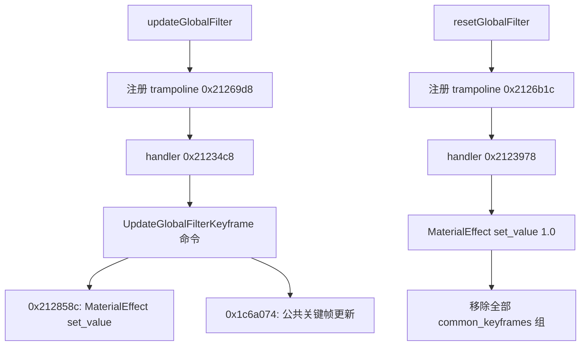

# GlobalFilterService 到材质和公共关键帧的实际状态变化

日期：2026-09-07。应用：剪映专业版 11.3.0。分支：`codex/jianying-binary-cpp-next`。

本轮沿 `Server::invoke` 找到真实注册表、请求 trampoline、处理函数及虚函数表，新增可执行的原创 C++ 状态合同。已确认 **update 把原始 double 写入 MaterialEffect；reset 在处理函数内直接构造 1.0，并移走该段全部 common_keyframes 组**。这不是根据 UI 默认值推测 reset。已有 ID 的关键帧更新也恢复到清除旧 graph、替换数值向量和修改标记。

实现位于 `research/independent-creator-contract/`：`common_keyframes.*` 管理公共关键帧状态；`editor_events.*` 组合处理器的已恢复状态变化；`native_events.mm` 是可选的隔离原生诊断。普通库和测试不加载剪映运行库、不依赖 Qt。材质 setter 复用 `independent-editor-contract/value_state.*`，没有复制一套实现。

本轮没有恢复完整 draft/session 查询、捕获时间定位、新建关键帧或 record rollback。`capture_lookup_required` 明确表示后续分支尚未实现，不能当成更新全部成功；此时已恢复的材质写入已经发生。

## 二进制身份与私有证据

| 项目 | 值 |
| --- | --- |
| 库 | `/Applications/VideoFusion-macOS.app/Contents/Frameworks/libvideoeditor.dylib` |
| Universal SHA-256 | `ee33e4e68ecf3dc05501d04c4415a3a52ce60c6a6ed3615330963e78be4c25ab` |
| arm64 UUID | `22337058-B217-3CAF-9979-CFECA7302CF7` |
| 私有证据 | `/Users/peter/Downloads/QCut-Binary-CPP-2026-09-07/creator-next/` |
| 既有客户端研究 | [VECreator C++ 请求合同](vecreator-cpp-contract-2026-09-07.zh.md) |

地址为该 arm64 Mach-O 的未滑动虚拟地址，范围右端不包含。静态证据由已有 arm64 thin 文件进行有界反汇编；完整安装库 SHA 与载入后的 SHA/UUID 在新原生探针中重新验证。`llvm-objdump` 会把 stripped 函数注释成最近的导出符号加偏移，不能把这些注释当作真实函数名；下面的处理器名称来自方法注册字符串、RTTI 和调用连接。

| 私有文件 | 地址/范围 | 支持内容 |
| --- | --- | --- |
| `service-register.asm` | `0x2127934–0x2127c80` | 方法名到 trampoline 的真实注册 |
| `handler-trampolines.asm` | update `0x21269d8`；reset `0x2126b1c` | 参数对象偏移、draft/context 取得、真实 handler 调用 |
| `update-handler.asm` | handler `0x21234c8–0x2123854` | 段解析、SegmentFilter 动态检查、KFTypeFilter 和命令对象 |
| `reset-handler.asm` | reset `0x2123978–0x2123c78`；通用更新驱动 `0x2123cec–0x2123e48` | reset literal、common 组移除；更新顺序与关键帧门禁输入 |
| `update-command.asm` | 材质写入 `0x212858c–0x2128834`；数值向量 `0x2128834–0x2128874` | raw double 到 MaterialEffect、单元素 vector |
| `vtable-data.json` | 命令表 `0x4cc26f0`；SegmentFilter 表 `0x4c1b970` | 两个命令虚函数、common getter 槽位 |
| `common-keyframe-access.asm` | `0x12216b8–0x1221770` | Segment common_keyframes 字段与访问器 |
| `common-keyframe-remove.asm` | `0x1222268–0x1222434` | retained 列表、子项 code3、数组 dirty、时钟写入 |
| `keyframe-update-base.asm` | `0x1c6a074–0x1c6ab10` | 门禁、ID 查找、捕获范围回退、create 分支 |
| `find-keyframe-id.asm` | `0x340ab30–0x340ad98` | 跳过 null、按字节精确比 ID、首匹配 |
| `common-values.asm` | setter `0xc7e1c8–0xc7e2f8` | 逐项数值相等、替换及 mutation flags |
| `compatibility-graph.asm` | `0x3410fc4–0x341125c` | 找目标关键帧后 set_graph(nullptr) |
| `common-graph.asm` | `0xc7e510–0xc7e5e4` | null graph 也写入并标记修改 |
| `keyframe-create.asm` | `0x21612e4–0x2161874` | play head、段范围/FPS 检查、AddCommonKeyframeReqStruct |
| `keyframe-update-finalize.asm` | 入口 `0x2161998` | finalizer 的 SegmentText 动态类型门禁 |

原始二进制、反汇编和载入输出均只在私有目录。`verification.json` 记录原创源文件、静态证据与测试日志的 SHA-256；仓库不包含供应商代码转储。

## 请求进入真实处理器



trampoline 把原请求对象 `+0xc8` 传作 params 基址。因此此前 VECreator wrapper 的字段现在能跨库连接：

| 请求对象偏移 | params 偏移 | 实际用途 |
| --- | --- | --- |
| `+0xe8` | `+0x20` | 段 ID，供 DraftQuery 查找 |
| `+0x100` | `+0x38` | 原始 double，材质 setter 与关键帧单元素 values 共用 |
| `+0x108` | `+0x40` | 是否允许本次关键帧处理，构造默认 true；并非此前 `+0x128` 字节 |
| `+0x110` | `+0x48` | 目标关键帧 ID，构造默认空 |
| `+0x128` | `+0x60` | wrapper 覆盖为 false；本轮不能为它命名 undo 或 keyframe enable |

update 外层先通过 `get_segment(draft,id,true)` 并动态转换 SegmentFilter。命令的材质分支再用 track type 数值 6 查询并转换 SegmentFilter；reset 也使用 type 6。查无段或类型不符均记录日志并退出。独立 `ResolvedFilterState` 从这些查询之后开始；调用方负责提供已经验证的滤镜段，不伪造或解析 SDK 对象。

命令 vtable 的首槽为 `0x212858c`，次槽为 `0x2128834`。通用驱动总是先调用首槽，再进入关键帧门禁。材质为空时材质分支退出，其他已恢复的关键帧路径仍可继续；reset 在材质为空时同样继续清理 common 组。

## 材质及已有关键帧的更新

材质写入直接使用 params `+0x38`，没有乘 100、取整或裁剪。`MaterialEffect::set_value` 的浮点相等判断和 mutation 变化复用前轮已原生差分验证的 editor 单元：`+0/-0` 相等保留旧位型；NaN 比较不相等而触发更新；tracking 非零且 code 为 0 时改成 2，写入时 changed 为 1。

公共关键帧目标为 `findKeyframes_(KFTypeFilter, "", false)` 的返回组。本合同把该解析结果显式交给调用方，以免凭猜测重建整个 Segment schema；非空输入组必须标为 `KFTypeFilter`，错误类型由 QCut 在写材质前拒绝。

对滤镜路径，关键帧状态机为：

1. 材质 setter 已执行。
2. `request_keyframe_enabled || auto_add_others_keyframe` 为 false：关键帧不处理。
3. 解析组不存在：不处理；auto 开启也不自动绕过这项检查。
4. 组列表为空且 auto 为 false：不处理。
5. 目标 ID 非空且命中首个非 null 条目：清空该条目的 graph，再写 values。
6. ID 为空或找不到：进入捕获时间范围查找，再可能创建关键帧。独立实现返回 `capture_lookup_required`，不猜选中哪个时间点，也不悄悄创建条目。

这里的重要反例是 **显式 ID 缺失不是直接 no-op**。`0x1c6a3bc` 落入 `0x1c6a3ec` 的捕获时间查找；测试要求这一分支不能报告已有关键帧更新成功。

已有 ID 查找按列表顺序匹配完整字符串长度和字节，跳过 null，首匹配即停止。独立 ID 比较保留重复 ID、内嵌 NUL 和空字符串行为；update 自身的空 ID 分支仍直接走捕获时间。

`compatibility_keyframe_graph` 重新按 ID 找到条目并调用 `set_graph(nullptr)`。在本已恢复的已有 ID 路径中，命中的就是首个同 ID 条目。该 setter **不检查旧 graph 是否为空**，始终设置关键帧 changed=1，并在 tracking 非零且 code=0 时将 code 改为 2。它不清相邻关键帧的 graph。

随后 `CommonKeyframe::set_values` 比较整个向量：长度相同且每项 `old[i] == new[i]` 时不替换，不额外修改标记；否则复制完整新向量并设置上述 mutation flags。Filter 命令产生的向量长度固定为 1，元素为 raw double。不同于字节相等，`-0/+0` 相等，两个同 payload NaN 不相等。

这产生一个有用的真实边界：材质和关键帧都已经等于新强度、旧 graph 已经为空时，数值位型保持，但关键帧仍会因 `set_graph(nullptr)` 被标记改变。原生通用更新函数返回 true 的依据是完成该分支，不要求 values setter 确实替换。

## Reset 的数值、范围和保留记录

`0x2123a80` 直接构造 binary64 位型 `0x3ff0000000000000`，随后 `0x2123a8c` 调 `MaterialEffect::set_value`。因此 reset 材质目标值是 **1.0**。setter 相等门禁仍生效：材质已经为 1 时无需 dirty；这不阻止后续组移除。

SegmentFilter 虚表 `+0x130` 连接到 `Segment::get_non_const_common_keyframes`，返回 Segment `+0xa8` 的 shared_ptr 字段。handler 访问其 NodeArray 活跃列表，遍历每一个条目调用移除 bookkeeping，最后清空活跃 vector。没有按属性筛选：KFTypeFilter、其他 common 属性、空组一并移走。**这里不是 SegmentFilter 的旧 `keyframes` vector**；本模块不包含或修改该旧格式。

每个移除条目发生以下状态变化：

| 条件/对象 | 结果 |
| --- | --- |
| 数组 `track_removed_children` 非零且条目 tracking 非零 | 条目 code 直接覆盖为 3，包括原 code 为 1、2、3 或其他值 |
| 条目 changed 字节 | 此 helper 不改它 |
| 数组 retained 列表 | 追加该条目的 shared_ptr；保留原前缀、顺序与重复别名 |
| 数组 tracking 非零且 code 为 0 | 数组 code 改为 2 |
| 数组 changed | 设置为 1 |
| 时钟字段 | 每个条目调用一次 system_clock::now，并作指针参与的编码写入 |

因此 reset 是从 active 列表移走组，组对象及其中关键帧通过 retained 引用继续存在。独立模型用自己的 `shared_ptr` 保留这种身份和别名语义。非空 active 清空后再次 reset，不再产生组移除或对应时钟写入；retained 原有内容保持。

本轮只记录 `clock_write_events` 数量，不输出假的时间戳。原代码在 `0x122240c–0x1222414` 将 `now()*1000` 与目标指针相加后写回该地址，不能把它简单命名成 Unix 微秒。也没有证据证明 retained 列表就是完整 undo 栈：其消费、合并和恢复策略仍未追完。

QCut 的明确边界策略：null 活跃组属于非法输入，先验证并预留 retained 容量，再写材质或状态；失败前不修改可见内容。原生没有对应的完整 null guard，也不承诺这种分配失败原子性，不能将该策略说成原生行为。

## Accept 与 undo 的当前结论

前轮已经确认 update 与 accept 构造相同的 UpdateFilter payload，区别包括外层 dispatch bool 和遥测。它们最终到达同一 `updateGlobalFilter` 方法，因而本轮恢复的材质和公共关键帧逻辑可用于这些请求。**不能据此宣布 accept 已完成 record commit，或 reset 会自动创建可撤销记录**。

前轮确认框第二回调的 `dismissRecord(session,false,-1)` 调用仍是边界证据；本轮没有调用它，也没有据此实现虚构的 undo 栈。`requests.*`、`model_gate.*`、`dialog_callbacks.*` 保持原来的有限声明。新增的 retained 行为是实际数据变化，名称刻意不使用 undo。

新建关键帧分支已静态定位到 `0x21612e4`：检查 play head 非负、父段偏移、目标范围及帧率边界，构造 `AddCommonKeyframeReqStruct`，再经 CommonClient 发出请求。其完整范围计算、请求默认字段和添加后的 graph 兼容处理未全部恢复，独立代码不会以 1.0 或现有 scalar 猜建新关键帧。

## 原生差分与测试

`native_events.mm` 只调用 64 字节的数值向量虚函数 `0x2128834–0x2128874`。静态审计证明它仅从输入指针 `+0x18` 读取 params 指针，再从 params `+0x38` 读取原始 8 字节，分配一个 double 并返回 libc++ vector；没有 draft/session、Qt、SDK setter 或调用方对象写入。

诊断分配原创 ABI 输入缓冲区，填好两个已验证字段后用 `mprotect(PROT_READ)` 保护整页。不是构造或修改真实 SDK 对象。调用返回的 vector 由普通 libc++ 析构释放。全库 SHA、载入路径 SHA、arm64 UUID、导出 anchor 和地址基准均验证后才调用；错误 SHA 和相对路径都拒绝。

结果：**10,008 个位型，长度和 capacity 均为 1，原始元素位型全部一致，0 mismatch**。样本包含正负零、subnormal、正负无穷、quiet/signaling NaN、多种 NaN payload，以及确定性伪随机 10,000 位型。原生加载器会向 stdout 输出初始化日志，原始日志保存在 `native-values.log`，结构化结果单独解析到 `native-values.json`。这项原生证明仅适用于该纯数值输出函数；完整 handler/reset 的证据仍是静态，不是原生 SDK 状态差分。

Release 与 ASan+UBSan 均运行六组、957 条检查：原有四组 525 条不变；新增公共关键帧 311 条、组合事件 121 条。新测试覆盖非有限、signed zero、向量维数、已空 graph、tracking/code 组合、缺失/重复 ID、auto 门禁、material null、重复别名、非滤镜 common 组、retained 前缀、重复 reset 和非法输入。

另在私有原创源码副本运行五个故意错误的实现：reset 值改为 0、只保留滤镜组、跳过已空 graph 的 dirty、缺失 ID 谎报成功、raw value 乘 100。五项均被对应测试捕获。未修改共享工作树来运行负控。

```sh
cmake -S research/independent-creator-contract -B "$CREATOR_BUILD" -DCMAKE_BUILD_TYPE=Release
cmake --build "$CREATOR_BUILD" -j4
ctest --test-dir "$CREATOR_BUILD" --output-on-failure
cmake -S research/independent-creator-contract -B "$CREATOR_SAN" -DCMAKE_BUILD_TYPE=Debug -DCREATOR_CONTRACT_SANITIZERS=ON
cmake --build "$CREATOR_SAN" -j4
ASAN_OPTIONS=detect_leaks=0:abort_on_error=1 UBSAN_OPTIONS=halt_on_error=1:print_stacktrace=1 ctest --test-dir "$CREATOR_SAN" --output-on-failure
```

`CREATOR_BUILD`/`CREATOR_SAN` 应指向 Downloads 或外部 SSD。ASan/UBSan 启用 `-fno-sanitize-recover=all`；此 macOS 工具链不支持 LeakSanitizer，未将其算作通过。
