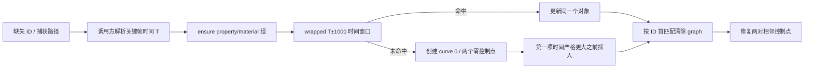

# GlobalFilter 缺失关键帧 ID 后的实际添加契约

日期：2026-09-07。对象：本机剪映专业版 11.3.0 的 `libvideoeditor.dylib`。代码位于 `research/independent-creator-contract/`，为原创 C++20；厂商二进制、反汇编、临时诊断输出均仅留在私有目录。

本轮把前轮 `capture_lookup_required` 之后的**时间已经定位**分支推进到实际组查找/创建、时间窗口碰撞、关键帧创建/更新、有序插入、graph 清理和相邻控制点修复。并非只构造请求计划。真实工厂创建的诊断对象上，1,200 个插入案例与 3,000 个控制点案例共比较 82,752 项，零差异。

仍不包含完整播放头定位、段/FPS 时间映射、事务提交/回滚、真实工程修改或像素输出。调用方必须明确提供已解析的关键帧时间；`timeline_time` 仅保留请求来源时间，不能把两种时间混用。

## 二进制身份与证据

- Universal SHA-256：`ee33e4e68ecf3dc05501d04c4415a3a52ce60c6a6ed3615330963e78be4c25ab`。
- arm64 UUID：`22337058-B217-3CAF-9979-CFECA7302CF7`。
- 安装路径：`/Applications/VideoFusion-macOS.app/Contents/Frameworks/libvideoeditor.dylib`。
- 私有证据：`/Users/peter/Downloads/QCut-Binary-CPP-2026-09-07/creator-insertion/`。
- 完整命令与逐文件 SHA-256：该目录的 `verification.json`、`native-commands.json`。有限反汇编由 `disassemble.py` 读取 Mach-O `LC_FUNCTION_STARTS` 确定函数结束地址；命令使用 thin arm64 的 `llvm-objdump -d --start-address --stop-address`。

| 私有文件 | 精确地址范围/关键调用点 | 已恢复内容 |
| --- | --- | --- |
| `common-registration.asm` | `0x1e4ecbc–0x1e4ed70`，注册指针 `0x1e4ed28` | `CommonService/addCommonKeyframe` → `0x1e2fe0c` |
| `add-trampoline.asm` | `0x1e2fe0c` 起；handler 调用 `0x1e2fe8c` | request `+0xc8` 参数复制后传实际 handler |
| `add-handler.asm` | `0x1d9aa8c–0x1d9b5cc` | 真实添加处理器、时间转换、碰撞、创建与后处理 |
| `add-request-constructor.asm` | `0x395234` 起，主要构造至 `0x3953b0` | 服务/方法、参数结构和默认字段 |
| `group-resolve.asm` | `0x340a010–0x340a284` | `ensureKeyframes`：复用组或构造并追加 |
| `group-find.asm` / `group-find-property.asm` | `0x340a504–0x340a7b0` / `0x340a394–0x340a504` | material 非空匹配两字段；为空只匹配 property |
| `params-update.asm` | `0x340c0c4–0x340c4a0` | 位掩码、值维数保持、首值补齐 |
| `sorted-insert.asm` | `0x340bb70–0x340bd48` | 第一项严格大于新时间之前插入；新增跟踪码 |
| `graph-compatibility.asm` | `0x3410fc4–0x341125c` | 重新按 ID 找首项，`set_graph(nullptr)` |
| `controls-default.asm` | `0x340d5f0–0x340d9c0` | 调用 previous→selected、selected→next 两对修复 |
| `controls-pair.asm` | `0x340d9c0–0x340dd94` | 控制点 0.4 比例、单边裁剪、非有限分支 |
| `frame-ctor.asm` / `factory-frame.asm` | `0xc7daec–0xc7de5c` / `0x2af2edc–0x2af3004` | 真实对象构造；诊断可用的完整分配 helper |
| `array-track.asm` / `group-track.asm` | `0xc86f7c–0xc86f84` / `0x36428c–0x364294` | 容器 `+0x60`、节点 `+0x20` 跟踪开关的真实 setter |
| `time-convert.asm` | `0x3407dbc–0x340824c` | `getKeyframeTimeOffsetByTimeline` 调用边界；未作为 portable 输入推断 |
| `server-invoke.asm` / `session-invoke.asm` | `0x4c2720–0x4c3164` / `0x4df044–0x4df130` | 更下游会话分发边界，不能据此判定提交/撤销成功 |

## 从 GlobalFilter 到 CommonService

前轮创建 helper `0x21612e4–0x2161874` 先检查播放头非负、父段偏移、段范围和帧率端点，随后构造 `AddCommonKeyframeReqStruct`，经 `CommonClient::addCommonKeyframe` 进入 `Server::invoke`。helper 在发出 client 调用后返回 true，并不读取响应中的插入结果，因此此 true 不能当作添加已成功。

本轮确认 `CommonService` 实际 handler `0x1d9aa8c`：

1. 按段 ID 执行 `DraftQuery::GetSegment`。没有段则结束。
2. `KFTypeNone` 结束；另有 uniform scale 条件下拒绝 `KFTypeScaleY` 的支路。当前独立代码面向已解析的 filter 组，不推广这些段类型规则。
3. 构造 `(property, material_id)`，调用 `getKeyframeTimeOffsetByTimeline` 将请求时间转换为关键帧偏移。
4. 请求 string value 和 numeric values 同时为空时，会先采样当前值；采样仍为空则结束。当前 API 显式拒绝这一分支，不猜默认值。
5. `ensureKeyframes` 查找/创建组，按 `[T-1000,T+1000]` 查关键帧。
6. 命中时更新现有对象；未命中时创建 `CommonKeyframe(true)`，设时间、更新参数，再按时间插入。
7. 用目标 ID 做 graph 兼容清理和两侧默认控制点修复。



时间窗口算法直接复用 `independent-editor-contract/window.*`。它不是对任意无序列表做全局最小距离搜索；遇到首次距离不再严格改善便停止，等距保留先到项。`T±1000` 以及算法中间运算按 arm64 64 位整数回绕复现，不用会溢出的 C++ signed 加减。这里的 `1000` 是原始时间偏移单位，未通过本轮调用把它独立标定成毫秒。

## 位掩码与原始数值

创建 helper 中 payload `+0x20` 的常量 **5 是字段更新掩码**：bit0=time，bit2=value。它不是 curve type。payload `+0x30` 的零是 curve 字段，但 bit1 没有开启，因此这条路径不会强制把已存在的曲线改成零。

| payload 相对位置 | 语义 | `fields=5` 行为 |
| --- | --- | --- |
| `+0x20` | 64 位字段掩码 | bit0 与 bit2 开启 |
| `+0x28` | 请求时间 | handler 先转换，更新用转换结果 T |
| `+0x30` | curve type | 不写 |
| `+0x38` | `vector<double>` | 非空时进入 numeric 更新 |
| `+0x50` | string value | 本 filter 路径为空 |
| 其他控制点/graph 字段 | 掩码 bit3/4/5 | 不从请求更新，交给后处理 |

numeric 请求有 `m>0` 个值，现有值有 `n` 个：

- `n=0`：保留完整请求的 m 个值。
- `0<n<m`：截断到前 n 项。
- `0<m<n`：末尾补 n−m 个**请求第一项**，不是末项或零。
- 长度相同直接使用请求值，然后进入已经恢复的逐项浮点相等 setter。

所有数值保持原始 double，不裁剪、不做百分比换算。NaN 比较不等会触发 setter；正负零相等则保留现有位型。独立实现拒绝现有长度大于 `INT32_MAX`，因为原代码把现有长度经过 signed32 窄化；不会为实际不可构造的巨量模型声称普遍等价。

当前 API 仅接受掩码 5 与非空 numeric 数组，其他掩码、string value、采样回退明确报错。这是 QCut 的有限输入域政策；不是声称原生拒绝所有这些功能。

## 组、插入顺序与跟踪状态

`ensure_common_keyframe_group`：material 非空时须同时匹配 property/material；material 为空时忽略已有组的 material，仅匹配 property。跳过空组指针，首匹配复用，不去重。未匹配时构造空组并追加到 active 末尾，保留原列表顺序和别名。

新关键帧 curve=0，time 初始为0，两个控制点为 `(0,0)`，graph 为空。ID 由宿主传入；没有仿制厂商 UUID。`insert_keyframe_ordered` 线性扫描，在第一项 `existing.time > new.time` 前插入，否则追加。相等时间留在旧项之后；它不会先整理原来已经乱序的列表。

容器 `+0x60` 的跟踪开关写入被加节点 `+0x20`；为 true 时节点 code 设1，changed 保留，不额外标脏容器；为 false 时被加节点与容器都标脏。mark dirty 仍是 tracking 非零且 code0 时变2，然后 changed=1。每次实际追加/插入有一次时钟写入事件。组创建时 property/material setter 自身也可能已标脏。

`CommonKeyframeArray::track_removed_children` 沿用前轮字段名，对应同一个容器 `+0x60`；现在也用于组插入。组内关键帧列表有单独的 `track_inserted_children` 与 `list_mutation`，不能把组自身的 dirty 状态当成它的列表状态。

这些 code 和时钟事件是可验证的模型 bookkeeping。它们不是完整 undo 栈，也没有提供假的时间戳值。新组对真实 Segment 的附着仍属静态证据；原生差分的组由 `ensureKeyframes(nullSegment, nonempty-material-key)` 创建，故没有真实段或工程参与。

## Graph 与两侧控制点

添加/更新后重新按 ID 查首匹配对象并清空 graph，即使 graph 原本已经为空也会标脏。重复 ID 不去重；后处理可能作用于更早的同 ID 对象。这一行为与按刚插入的 index 直接操作不同。

对相邻端点 L、R：空端点整对不操作。curve type 为0时，对应端点的控制点不动；非零时才修复 L 的 right control 与 R 的 left control。时间差先整数回绕再转 double：

- `dR = double(wrap64(R.time−L.time))`
- `dL = double(wrap64(L.time−R.time))`

对应控制点缺失则创建零点。x 与零数值相等时，设 `x=d*0.4+0.0`、`y=0.0`，其中乘、加分别执行，关闭 FMA contraction。x 非零时，right 仅在 `x>=dR` 时设为 dR；left 仅在 `x<=dL` 时设为 dL。另一个方向不裁剪，y 保留。NaN 在两侧比较中都保留原 x 位型；Infinity 按实际比较处理。相等坐标的 setter 不写入，所以零值的符号也不能随意归一化。

原生差分核对了控制点 x/y 位型、点的 mutation 与端点 mutation。null 控制点的创建分支为静态证据与原创单元测试，未纳入原生差分：早期隔离诊断发现公开 control setter 不接受 null，会在 setter 内解引用空指针；该调用已经删除，失败日志保留。最终 probe 仅使用真实工厂提供的非空控制点，不修改真实 app，不伪造对象或控制块。

## 验证与限制

| 验证 | 结果 | 证明范围 |
| --- | --- | --- |
| 严格 C++20 Release | 8/8 组、1082 项断言通过 | 旧6组保留，新增88项 insertion与37项 controls |
| ASan + UBSan | 8/8 组通过、fail-fast | 原创代码；不是厂商整个运行时的 sanitizer 证明 |
| 原生插入 | 1200 案例通过 | 重复/无序/极端时间、tracked/untracked、顺序、身份、mutation、graph 清理 |
| 原生控制点 | 3000 案例通过 | 0–3 curve、±0、NaN/Inf、正负/零/回绕时间差 |
| 原生总比较 | 82,752 项，0 mismatch | 直接调用已确认 ABI 的有限 helper，非整个 handler 运行 |
| 原生 probe ASan/UBSan | 同批通过 | probe 与原创模型被 instrument；厂商 dylib 未 instrument，厂商全局初始化禁用 leak 检查 |
| 负控制 | 4 个原创 mutant 被检测，2 个身份门禁拒绝 | 0.4→0.5、同时间插前、code1→2、补首项→补末项；相对路径与未知SHA拒绝 |

`native_insertion.mm` 复用 `native_keyframes.hpp` 的已核验真实工厂，所有原生对象通过真实 shared_ptr 控制块析构。加载前验证完整文件 SHA、加载后的镜像 SHA、UUID、arm64 和导出锚点；默认 portable build 不加载厂商库。命令与日志可在 `native-commands.json` 逐条复核。

构建示例（从 qcut 包目录）：

```sh
cmake -S research/independent-creator-contract -B /tmp/creator-insertion -DCMAKE_BUILD_TYPE=Release
cmake --build /tmp/creator-insertion -j 4
ctest --test-dir /tmp/creator-insertion --output-on-failure
```

可选 `CREATOR_CONTRACT_NATIVE_PROBE=ON` 构建 `creator-native-insertion`，仅限 macOS arm64，运行时显式给出安装库路径及 app Frameworks 搜索目录。

本轮还追到 `Session::invoke`：请求 `+0x38` 为−1时通过 session 的接口填入上下文标识，再走 session `+0x28` 分发对象的虚槽 `+0x28`。这不足以命名 request `+0x40=3` 的事务策略，也不能证明 accept 自动提交或 reset 自动可撤销。完整 record 消费、rollback/commit 仍是下一层边界；此处不以默认常量或 UI 名称补齐它们。
