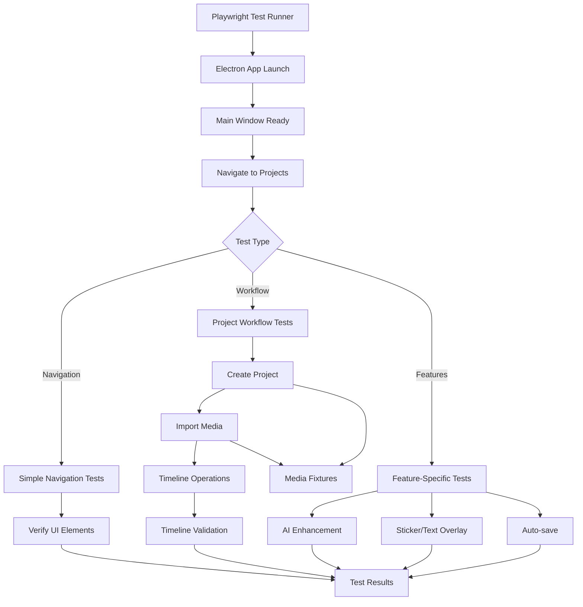

# E2E Testing Infrastructure - QCut Video Editor

## 📊 **Current Status Summary**

**✅ WORKING: 15 tests passing** - Core video editing workflow fully functional
**❌ FAILING: 51+ tests failing** - Advanced features need helper function updates
**🎯 PRIORITY: Fix multi-media management tests** - Extends core functionality

## Overview

QCut's End-to-End (E2E) testing infrastructure provides comprehensive testing for the Electron-based video editor application. The test suite uses Playwright to automate real user interactions across the entire application stack, from project creation to media import and timeline editing.

**The core video editing workflow is fully tested and working reliably.** Advanced features have failing tests that need systematic updates to use established helper patterns.

## Architecture

### Tech Stack
- **Framework**: Playwright with TypeScript
- **Target**: Electron application (Chromium-based)
- **Test Runner**: Playwright Test Runner
- **Configuration**: Single-worker sequential execution to avoid port conflicts

### Key Design Principles
- **Real User Workflows**: Tests simulate actual user interactions
- **Non-Breaking**: All test additions use `data-testid` attributes without modifying existing functionality
- **Robust Waiting**: State-based waiting patterns instead of fixed timeouts
- **Media Fixtures**: Pre-created test media files for consistent testing

## File Structure

```
qcut/
├── playwright.config.ts                 # Playwright configuration
├── apps/web/src/test/e2e/
│   ├── helpers/
│   │   └── electron-helpers.ts          # Core helper functions and fixtures
│   ├── fixtures/media/                  # Test media files
│   │   ├── sample-video.mp4            # 5-second 720p test video
│   │   ├── sample-audio.mp3            # 5-second sine wave audio
│   │   └── sample-image.png            # 1280x720 blue test image
│   └── test files/
│       ├── simple-navigation.e2e.ts    # Basic navigation tests
│       ├── editor-navigation.e2e.ts    # Editor-specific navigation
│       ├── project-workflow-part1.e2e.ts  # Project creation & media import
│       ├── project-workflow-part2.e2e.ts  # Timeline operations
│       ├── project-workflow-part3.e2e.ts  # Export & persistence
│       ├── ai-enhancement-*.e2e.ts     # AI feature tests
│       ├── sticker-text-overlay-*.e2e.ts  # Overlay feature tests
│       ├── auto-save-*.e2e.ts          # Auto-save feature tests
│       └── cross-platform-*.e2e.ts    # Cross-platform tests
└── test-results/                       # Generated test artifacts (gitignored)
```

## Core Functions and Architecture

### Electron Helpers (`electron-helpers.ts`)

#### 1. Test Fixtures
```typescript
export interface ElectronFixtures {
  electronApp: ElectronApplication;  // Electron app instance
  page: Page;                       // Main window page
}
```

#### 2. Core Navigation Functions
```typescript
// Navigates from home page to projects page
export async function navigateToProjects(page: Page)

// Creates a new project (handles both empty state and existing projects)
export async function createTestProject(page: Page, projectName?: string)

// Waits for project to fully load in editor
export async function waitForProjectLoad(page: Page)
```

#### 3. Media Import Functions
```typescript
// Uploads any test media file
export async function uploadTestMedia(page: Page, filePath: string)

// Specific media type imports
export async function importTestVideo(page: Page)
export async function importTestAudio(page: Page)
export async function importTestImage(page: Page)
```

#### 4. Utility Functions
```typescript
// Starts Electron app with test configuration
export async function startElectronApp()

// Gets main window with readiness checks
export async function getMainWindow(electronApp: ElectronApplication)

// Waits for app to be fully ready
export async function waitForAppReady(page: Page)
```

## Test Architecture Diagram



## How to Run E2E Tests

### Prerequisites
1. **Build the project**:
   ```bash
   cd qcut
   bun run build
   ```

2. **Ensure Electron app works**:
   ```bash
   bun run electron
   ```

### Running Tests

#### Run All E2E Tests
```bash
cd qcut
bun x playwright test --project=electron
```

#### Run Specific Test Files
```bash
# Basic navigation tests
bun x playwright test simple-navigation.e2e.ts --project=electron

# Project workflow tests
bun x playwright test project-workflow-part1.e2e.ts --project=electron

# Editor navigation tests
bun x playwright test editor-navigation.e2e.ts --project=electron
```

#### Run Single Test
```bash
# Run specific test by line number
bun x playwright test project-workflow-part1.e2e.ts:19 --project=electron

# Run by test name pattern
bun x playwright test --project=electron --grep "should create project"
```

#### Debug Mode
```bash
# Run with headed browser for debugging
bun x playwright test --project=electron --headed

# Run with debug mode (step through)
bun x playwright test --project=electron --debug
```

#### Test Reports
```bash
# Generate and open HTML report
bun x playwright show-report

# Run with specific reporter
bun x playwright test --project=electron --reporter=html
```

### Configuration Options

#### Playwright Configuration (`playwright.config.ts`)
```typescript
export default defineConfig({
  testDir: './apps/web/src/test/e2e',
  fullyParallel: false,        // Sequential execution for Electron
  workers: 1,                  // Single worker to avoid port conflicts
  retries: process.env.CI ? 2 : 0,
  timeout: 30000,              // 30-second test timeout

  projects: [{
    name: 'electron',
    testMatch: '**/*.e2e.ts'
  }]
});
```

## Test Categories

### 1. Navigation Tests (`simple-navigation.e2e.ts`)
- Basic app navigation
- Project page loading
- Button detection and interaction
- No actual project creation (safe for repeated runs)

### 2. Project Workflow Tests
#### Part 1 (`project-workflow-part1.e2e.ts`)
- Project creation
- Media import (video, audio, image)
- Basic file upload processes

#### Part 2 (`project-workflow-part2.e2e.ts`)
- Timeline operations
- Media element manipulation
- Drag-and-drop functionality

#### Part 3 (`project-workflow-part3.e2e.ts`)
- Project persistence
- Export functionality
- Session state management

### 3. Feature-Specific Tests
- **AI Enhancement**: AI-powered video enhancement features
- **Sticker/Text Overlay**: Adding stickers and text to timeline
- **Auto-save**: Automatic project saving functionality
- **Cross-platform**: File handling across different environments

## Best Practices

### 1. Test Data Management
- Use pre-created test media files
- Clean up test projects after runs (when needed)
- Use descriptive project names with timestamps

### 2. Waiting Strategies
```typescript
// ✅ Good: State-based waiting
await page.waitForSelector('[data-testid="timeline-track"]');

// ❌ Bad: Fixed timeouts
await page.waitForTimeout(5000);
```

### 3. Element Selection
```typescript
// ✅ Good: Use data-testid attributes
await page.getByTestId('new-project-button').click();

// ✅ Good: Use semantic selectors as fallback
await page.locator('text=New Project').click();

// ❌ Bad: Use fragile CSS selectors
await page.locator('.btn-primary.header-button').click();
```

### 4. Error Handling
```typescript
// ✅ Good: Graceful degradation
const button = page.getByTestId('optional-button');
if (await button.isVisible()) {
  await button.click();
}

// ✅ Good: Multiple fallback strategies
await Promise.race([
  page.waitForSelector('[data-testid="success"]'),
  page.waitForSelector('[data-testid="error"]')
]);
```

## Troubleshooting

### Common Issues

#### 1. Port Conflicts
**Symptom**: "address already in use ::18000"
**Solution**: Ensure `workers: 1` in `playwright.config.ts`

#### 2. Element Not Found
**Symptom**: Timeout waiting for selectors
**Solutions**:
- Check if `data-testid` attributes exist
- Verify app navigation completed
- Use browser debug mode: `--headed --debug`

#### 3. File Upload Issues
**Symptom**: File dialog appears but files not selected
**Solutions**:
- Verify test media files exist in `fixtures/media/`
- Check file path resolution in `mediaPath()` function
- Ensure absolute paths are used

#### 4. Electron App Crashes
**Symptom**: "Target page, context or browser has been closed"
**Solutions**:
- Check Electron app builds correctly: `bun run build`
- Verify no conflicting processes on required ports
- Review console errors in test output

### Debug Commands

```bash
# Check if test media files exist
ls -la apps/web/src/test/e2e/fixtures/media/

# Verify Electron app starts
bun run electron

# Run single test with full output
bun x playwright test simple-navigation.e2e.ts --project=electron --reporter=list

# Debug test with browser visible
bun x playwright test --project=electron --headed --debug
```

## Development Guidelines

### Adding New Tests

1. **Create test file** following naming convention: `feature-name.e2e.ts`

2. **Import required helpers**:
   ```typescript
   import { test, expect, createTestProject } from './helpers/electron-helpers';
   ```

3. **Use consistent test structure**:
   ```typescript
   test.describe('Feature Name', () => {
     test('should perform specific action', async ({ page }) => {
       // Test implementation
     });
   });
   ```

4. **Add data-testid attributes** to UI components as needed

### Extending Helper Functions

1. **Add new helpers** to `electron-helpers.ts`
2. **Export functions** for use in test files
3. **Follow existing patterns** for error handling and waiting
4. **Document complex functions** with JSDoc comments

### CI/CD Integration

```yaml
# Example GitHub Actions integration
- name: Run E2E Tests
  run: |
    cd qcut
    bun run build
    bun x playwright test --project=electron --reporter=html
```

## Performance Considerations

- **Sequential Execution**: Tests run one at a time to avoid resource conflicts
- **Shared Test Media**: Reuse pre-created media files instead of generating new ones
- **State Cleanup**: Tests handle existing projects gracefully without requiring cleanup
- **Timeout Management**: Appropriate timeouts for different operations (navigation: 10s, media import: 15s)

## Future Enhancements

- **Parallel Test Execution**: Investigate running tests in parallel with isolated Electron instances
- **Visual Regression Testing**: Add screenshot comparison tests for UI consistency
- **Performance Testing**: Measure and assert on video processing performance
- **Cross-Platform Testing**: Test on Windows, macOS, and Linux
- **Mobile Testing**: Test responsive design on different screen sizes

---

## Current Test Status (Updated: September 16, 2025)

### ✅ **Working Tests (15 tests passing)**

#### **Core Workflow Tests (9/9 passing) - FULLY FUNCTIONAL**
- **`project-workflow-part1.e2e.ts`** - ✅ 2/2 tests passing
  - ✅ Project creation and media import workflow
  - ✅ File upload process validation

- **`project-workflow-part2.e2e.ts`** - ✅ 3/3 tests passing
  - ✅ Timeline interaction and media handling
  - ✅ Timeline element operations
  - ✅ Timeline element manipulation

- **`project-workflow-part3.e2e.ts`** - ✅ 4/4 tests passing
  - ✅ Project persistence testing
  - ✅ Export functionality access
  - ✅ Project state across sessions
  - ✅ Export configuration handling

#### **Navigation Tests (5/6 passing) - MOSTLY FUNCTIONAL**
- **`editor-navigation.e2e.ts`** - ✅ 3/3 tests passing
  - ✅ Existing project detection
  - ✅ Project opening without crashes
  - ✅ Direct navigation to editor

- **`simple-navigation.e2e.ts`** - ✅ 2/3 tests passing
  - ✅ Projects page navigation
  - ✅ Project creation button detection
  - ❌ Project creation button interaction (visibility issue with responsive design)

### ❌ **Failing Tests (51+ tests failing)**

#### **Feature-Specific Tests - NOT WORKING**
These tests have infrastructure issues and need significant fixes:

- **`auto-save-export-file-management.e2e.ts`** - ❌ 0/6 tests passing
  - Issues: App crashes, timeout issues, missing helper functions
  - Errors: "Target page, context or browser has been closed"

- **`multi-media-management-part1.e2e.ts`** - ❌ 0/5 tests passing
  - Issues: Duplicate button selectors, app crashes during media import
  - Errors: Strict mode violations, timeouts

- **`multi-media-management-part2.e2e.ts`** - ❌ Status unknown (not tested)

- **`ai-enhancement-export-integration.e2e.ts`** - ❌ 0/5+ tests passing
  - Issues: App crashes, timeouts, missing AI features
  - Errors: Test timeouts, missing UI elements

- **`ai-transcription-caption-generation.e2e.ts`** - ❌ Status unknown

- **`file-operations-storage-management.e2e.ts`** - ❌ Status unknown

- **`sticker-overlay-testing.e2e.ts`** - ❌ Status unknown

- **`text-overlay-testing.e2e.ts`** - ❌ Status unknown

### **Common Issues in Failing Tests:**

1. **Duplicate Button Selectors**: Many tests use direct `page.getByTestId('new-project-button').click()` instead of helper functions
2. **App Crashes**: Electron app becomes unresponsive during complex operations
3. **Missing Helper Imports**: Tests don't import `createTestProject` and other helper functions
4. **Timeout Issues**: Tests have insufficient timeouts for complex operations
5. **Missing UI Elements**: Tests expect UI elements that may not exist or be implemented yet
6. **Navigation Issues**: Tests use `page.goto()` which doesn't work in Electron

### **Recommendations for Fixing Failing Tests:**

1. **Update Import Statements**: Add `createTestProject` to all test imports
2. **Replace Direct Button Clicks**: Use `createTestProject(page, 'Test Name')` instead of direct button clicks
3. **Fix Navigation**: Replace `page.goto('/')` with proper hash-based navigation
4. **Increase Timeouts**: Set appropriate timeouts for complex operations (15-30 seconds)
5. **Add Error Handling**: Implement try-catch blocks for unstable operations
6. **Check UI Implementation**: Verify that expected UI elements actually exist in the app

### Step-by-Step Workflow for Fixing Failing Tests

1. Pick one failing spec from the list above and run it in isolation with `bun x playwright test <file> --project=electron`.
2. Reproduce the failure with Playwright's inspector (`--headed --debug`) so you can observe navigation and UI state.
3. Audit the test imports and replace any direct selectors with the helper functions documented earlier.
4. Update the test (and helpers if needed) to use stable selectors, state-based waits, and explicit error handling.
5. Re-run the same spec until it passes without flakiness, then move on to the next failing spec.

### **Priority for Fixes:**

1. **High Priority**: `multi-media-management-*.e2e.ts` (extends core functionality)
2. **Medium Priority**: `auto-save-export-file-management.e2e.ts` (important features)
3. **Low Priority**: AI and overlay tests (may depend on feature completion)

---

This E2E testing infrastructure provides **reliable coverage of core video editing functionality** with 15 working tests. The failing tests represent advanced features and need systematic updates to use the established helper patterns.