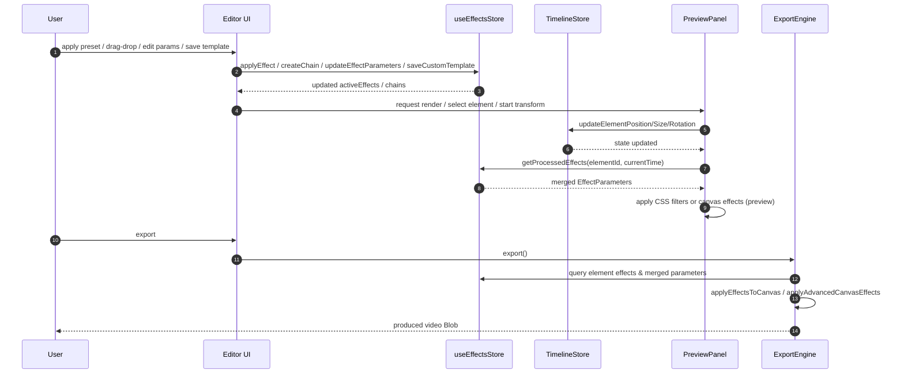

# Effects Workflow Sequence Diagram

## Overview
This diagram illustrates the complete workflow for effects processing in the QCut editor, from user interaction through to final export.

## Sequence Flow

## Key Components

### User (U)
- Initiates all actions in the workflow
- Applies presets, edits parameters, saves templates
- Triggers export process

### Editor UI
- Main interface component
- Handles user interactions
- Coordinates between stores and preview

### useEffectsStore (ES)
- Manages effect state and parameters
- Handles effect chains and templates
- Provides processed effects for elements

### TimelineStore (TS)
- Manages element positioning and transformations
- Updates element properties (position, size, rotation)

### PreviewPanel (PV)
- Renders preview with applied effects
- Queries and applies CSS/canvas effects
- Handles real-time transformations

### ExportEngine (EX)
- Processes final video export
- Applies effects to canvas
- Generates video Blob output

## Workflow Steps

1. **User Interaction**: User applies presets, drag-drops effects, edits parameters, or saves templates
2. **Effect Management**: Editor UI updates the effects store with new effects or parameter changes
3. **State Update**: Effects store returns updated active effects and chains to UI
4. **Preview Request**: UI requests preview render or element selection/transformation
5. **Timeline Update**: Preview panel updates timeline store with position/size/rotation changes
6. **State Confirmation**: Timeline store confirms state updates
7. **Effect Processing**: Preview panel queries processed effects for specific element and time
8. **Parameter Merge**: Effects store returns merged effect parameters
9. **Preview Rendering**: Preview panel applies CSS filters or canvas effects for real-time preview
10. **Export Initiation**: User triggers export process
11. **Export Processing**: Export engine queries element effects and parameters
12. **Canvas Application**: Export engine applies effects to canvas
13. **Video Generation**: Final video Blob is produced and returned to user