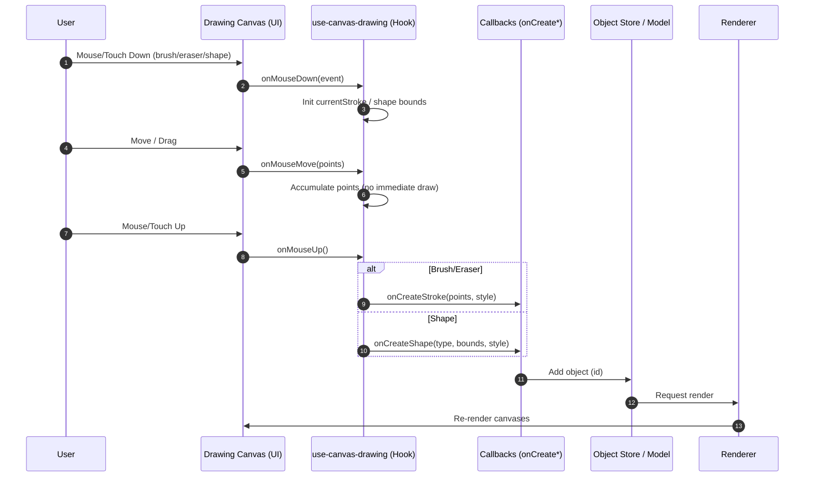

# Drawing Canvas Architecture - Sequence Diagram

This document describes the sequence of events in the drawing canvas system from user interaction to visual rendering.

## Overview

The drawing canvas follows a unidirectional data flow pattern where user interactions trigger hook callbacks that create objects in the store, which then trigger re-renders.

## Sequence Diagram



## Key Components

### 1. Drawing Canvas (UI)
- **File**: `apps/web/src/components/editor/draw/canvas/drawing-canvas.tsx`
- **Role**: Handles DOM events and delegates to drawing hook
- **Responsibilities**:
  - Capture mouse/touch events
  - Manage canvas element references
  - Coordinate between drawing hook and object store

### 2. use-canvas-drawing (Hook)
- **File**: `apps/web/src/components/editor/draw/hooks/use-canvas-drawing.ts`
- **Role**: Core drawing logic and event handling
- **Responsibilities**:
  - Process mouse/touch coordinates
  - Accumulate stroke points during drag
  - Calculate shape bounds
  - Trigger object creation callbacks

### 3. Callbacks (onCreate* and interaction callbacks)
- **Location**: Drawing canvas component
- **Types**:
  - `onCreateStroke`: For brush/pencil/eraser tools
  - `onCreateShape`: For rectangle/circle/line tools
  - `onCreateText`: For text tool
  - `onSelectObject`: For selecting objects at a position (supports multi-select)
  - `onMoveObject`: For dragging selected objects to a new position
  - `onEndMove`: Called when a move/drag operation finishes
  - `onTextInput`: Triggered when the user taps to place text
- **Role**: Bridge between drawing hook and object store

### 4. Object Store / Model
- **File**: `apps/web/src/components/editor/draw/hooks/use-canvas-objects.ts`
- **Role**: Centralized state management for canvas objects
- **Responsibilities**:
  - Store stroke, shape, text, and image objects
  - Manage object selection and manipulation
  - Trigger re-renders when objects change
  - Manage object groups via `ObjectGroup` interface (id, objectIds, createdAt)
  - Group/ungroup operations for multi-object manipulation

### 5. Renderer
- **Location**: Drawing canvas useEffect hooks
- **Role**: Render objects to canvas elements
- **Responsibilities**:
  - Clear and redraw canvases
  - Render objects in correct z-order
  - Handle dual-canvas system (background + drawing)

## Flow Details

### Stroke Creation (Brush/Pencil/Eraser)
1. **Mouse Down**: Initialize empty stroke array
2. **Mouse Move**: Continuously collect points (no immediate drawing)
3. **Mouse Up**: Create stroke object with all collected points
4. **Store Update**: Add stroke to objects array
5. **Re-render**: Canvas clears and redraws all objects

### Shape Creation (Rectangle/Circle/Line)
1. **Mouse Down**: Store start position
2. **Mouse Move**: Track current position (no immediate drawing)
3. **Mouse Up**: Calculate final bounds and create shape object
4. **Store Update**: Add shape to objects array
5. **Re-render**: Canvas clears and redraws all objects

## Architecture Benefits

### No Immediate Drawing
- **Problem Solved**: Prevents flickering from immediate strokes being overwritten
- **Benefit**: Consistent rendering through object system

### Point Accumulation
- **Problem Solved**: Smooth strokes with multiple points vs. just start/end
- **Benefit**: Better drawing quality and user experience

### Dual Canvas System
- **Background Canvas**: Images and background elements
- **Drawing Canvas**: Strokes, shapes, and text
- **Benefit**: Proper layering and performance optimization

### Unidirectional Data Flow
- **Pattern**: User → Hook → Callback → Store → Render
- **Benefit**: Predictable state management and easier debugging

## Debugging

The system includes extensive debug logging:
- `🖱️ MOUSE` events
- `🖌️ PENCIL` stroke operations
- `🔲 SHAPE` creation
- `🎨 CANVAS` rendering

Enable with: `VITE_DEBUG_DRAW=1`

## DrawingCanvasHandle (Exposed Methods)

The `DrawingCanvas` component exposes an imperative handle via `forwardRef` with the following methods:

| Method | Description |
|--------|-------------|
| `handleImageUpload(file)` | Upload and place an image onto the canvas |
| `loadDrawingFromDataUrl(dataUrl)` | Restore a saved drawing from a data URL |
| `getSelectedCount()` | Return the number of currently selected objects |
| `getHasGroups()` | Return whether any object groups exist |
| `getCanvasDataUrl()` | Export the current canvas as a data URL |
| `handleCreateGroup()` | Group the currently selected objects |
| `handleUngroup()` | Ungroup the currently selected group |
| `clearAll()` | Remove all objects and clear the canvas |

## Group System

Objects can be grouped together using the `ObjectGroup` interface defined in `use-canvas-objects.ts`:

```typescript
interface ObjectGroup {
  id: string;
  objectIds: string[];
  createdAt: number;
}
```

Group operations are exposed through the `DrawingCanvasHandle` (`handleCreateGroup`, `handleUngroup`) and managed internally by the object store hooks (`use-canvas-objects.ts`, `use-canvas-images.ts`). The `group-controls.tsx` component provides the UI for group/ungroup actions.

## Additional Files

### Components (`components/editor/draw/components/`)
| File | Purpose |
|------|---------|
| `group-controls.tsx` | UI for group/ungroup actions |
| `saved-drawings.tsx` | Saved drawings list and restore |
| `text-input-modal.tsx` | Modal for entering text on canvas |
| `canvas-toolbar.tsx` | Toolbar with drawing actions (save, clear, etc.) |
| `tool-selector.tsx` | Tool picker (brush, shape, eraser, etc.) |

### Utils (`components/editor/draw/utils/`)
| File | Purpose |
|------|---------|
| `canvas-utils.ts` | Canvas rendering and coordinate helpers |
| `drawing-storage.ts` | Save/load drawings to storage |
| `timeline-integration.ts` | Bridge between canvas and timeline |

### Hooks
| File | Purpose |
|------|---------|
| `hooks/use-canvas-images.ts` | Image upload, placement, and group management for image objects |

### Constants
| File | Purpose |
|------|---------|
| `constants/drawing-tools.tsx` | Tool definitions and icon mappings |