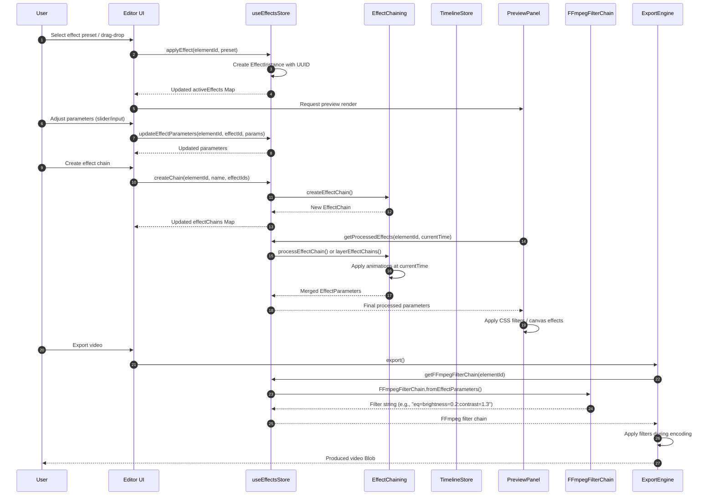

# Effects Workflow Sequence Diagram

**Last Updated:** 2026-02-28

## Overview
This diagram illustrates the complete workflow for effects processing in the QCut editor, from user interaction through to final export.

## Architecture

### File Structure
```
apps/web/src/
├── stores/
│   ├── effects-store.ts             # Re-export from ai/ (< 1KB)
│   └── ai/
│       └── effects-store.ts         # Main effects state management (22KB)
├── types/
│   └── effects.ts                   # Effect type definitions (4KB)
├── lib/
│   ├── effects/
│   │   ├── index.ts                 # Barrel exports (< 1KB)
│   │   ├── effects-chaining.ts      # Chain processing & animations (8KB)
│   │   ├── effects-utils.ts         # Utility functions (10KB)
│   │   ├── effects-keyframes.ts     # Keyframe interpolation (7KB)
│   │   ├── effects-canvas-advanced.ts # Canvas rendering (10KB)
│   │   └── canvas-utils.ts          # Canvas helper utilities (4KB)
│   └── ffmpeg/
│       └── ffmpeg-filter-chain.ts   # FFmpeg filter generation (2KB)
├── components/editor/
│   ├── effect-chain-manager.tsx     # Chain management UI (8KB)
│   └── effect-templates-panel.tsx   # Templates panel (10KB)
└── config/
    └── features.ts                  # EFFECTS_ENABLED flag
```

## Sequence Flow



## Key Components

### useEffectsStore (ES)
Main Zustand store for effect state management.

Located at `stores/ai/effects-store.ts` (re-exported from `stores/effects-store.ts`).

**State:**
```typescript
interface EffectsStore {
  presets: EffectPreset[];                    // 35 preset effects
  activeEffects: Map<string, EffectInstance[]>; // elementId -> effects
  effectChains: Map<string, EffectChain[]>;   // elementId -> chains
  selectedCategory: EffectCategory | "all";
  selectedEffect: EffectInstance | null;
}
```

**Actions:**
| Action | Description |
|--------|-------------|
| `applyEffect` | Apply preset to element |
| `removeEffect` | Remove effect from element |
| `updateEffectParameters` | Update effect parameters |
| `toggleEffect` | Enable/disable effect |
| `clearEffects` | Remove all effects from element |
| `setSelectedCategory` | Set the active effect category filter |
| `setSelectedEffect` | Set the currently selected effect instance |
| `getElementEffects` | Get effects for an element |
| `getEffectsForElement` | Alias for `getElementEffects` (backward compat) |
| `duplicateEffect` | Clone an effect |
| `reorderEffects` | Change effect order |
| `resetEffectToDefaults` | Reset to preset defaults |
| `resetEffectParameters` | Alias for `resetEffectToDefaults` |
| `updateEffectAnimations` | Add/update keyframe animations |
| `createChain` | Create effect chain |
| `removeChain` | Delete effect chain |
| `updateChainBlendMode` | Change chain blend mode |
| `toggleEffectInChain` | Toggle an effect within a chain |
| `moveEffectInChain` | Move an effect to a new index |
| `getProcessedEffects` | Get merged parameters for time |
| `getFFmpegFilterChain` | Get FFmpeg filter string |

### Effect Types (46+)
```typescript
type EffectType =
  // Basic (9)
  | "blur" | "brightness" | "contrast" | "saturation"
  | "hue" | "gamma" | "sepia" | "grayscale" | "invert"
  // Style (11)
  | "vintage" | "dramatic" | "warm" | "cool" | "cinematic"
  | "vignette" | "grain" | "sharpen" | "emboss" | "edge" | "pixelate"
  // Distortion (4)
  | "wave" | "twist" | "bulge" | "fisheye"
  // Artistic (4)
  | "oil-painting" | "watercolor" | "pencil-sketch" | "halftone"
  // Transition (4)
  | "fade-in" | "fade-out" | "dissolve" | "wipe"
  // Composite (4)
  | "overlay" | "multiply" | "screen" | "color-dodge";
```

### Effect Categories (8)
| Category | Description |
|----------|-------------|
| `basic` | Brightness, contrast, blur, sharpen |
| `color` | Saturation, warm, cool, vibrant |
| `artistic` | Grayscale, sketch, halftone, emboss |
| `vintage` | Sepia, film grain, vintage film |
| `cinematic` | Dramatic, cinematic, vignette |
| `distortion` | Wave, twist, bulge, fisheye, pixelate |
| `transition` | Fade in/out, dissolve, wipe |
| `composite` | Overlay, multiply, screen, color dodge |

### Preset Effects (35)
**Implemented (9):**
- Brighten, Darken, High Contrast
- Vibrant, Muted, Sepia
- Black & White, Soft Blur, Invert

**Not Yet Implemented (26):**
- Vintage Film, Dramatic, Warm, Cool
- Chromatic, Radiance, Cinematic
- Sharpen, Emboss, Edge Detection, Pixelate
- Vignette, Film Grain
- Wave, Twist, Bulge, Fisheye
- Oil Painting, Watercolor, Pencil Sketch, Halftone
- Dissolve, Wipe
- Overlay, Multiply, Screen, Color Dodge

### Effect Chaining (EC)
Located in `lib/effects/effects-chaining.ts`.

**Chain Processing:**
```typescript
interface EffectChain {
  id: string;
  name: string;
  effects: EffectInstance[];
  blendMode?: "normal" | "overlay" | "multiply" | "screen";
}

function processEffectChain(
  effects: EffectInstance[],
  currentTime?: number
): EffectParameters;

function layerEffectChains(
  chains: EffectChain[],
  currentTime?: number
): EffectParameters;
```

**Parameter Merging:**
- **Additive parameters**: brightness, contrast, saturation, hue (values are summed)
- **Override parameters**: blur, grayscale, invert (last value wins)
- Values are clamped to valid ranges after merging

### Animation System
**Keyframe Structure:**
```typescript
interface EffectKeyframe {
  time: number;    // Seconds relative to element start
  value: number;
  easing?: "linear" | "ease-in" | "ease-out" | "ease-in-out" | "cubic-bezier";
  controlPoints?: [number, number, number, number];
}

interface AnimatedParameter {
  parameter: keyof EffectParameters;
  keyframes: EffectKeyframe[];
  interpolation?: "linear" | "step" | "smooth";
}
```

### FFmpeg Filter Chain (FF)
Located in `lib/ffmpeg/ffmpeg-filter-chain.ts`. Converts effect parameters to FFmpeg filter syntax.

**Example Output:**
```
eq=brightness=0.2,eq=contrast=1.3,eq=saturation=1.4,boxblur=2:1
```

**Supported Filters:**
| Effect | FFmpeg Filter |
|--------|---------------|
| brightness | `eq=brightness=X` |
| contrast | `eq=contrast=X` |
| saturation | `eq=saturation=X` |
| hue | `hue=h=X` |
| blur | `boxblur=X:1` |
| grayscale | `hue=s=0` |
| invert | `negate` |

## Workflow Steps

### 1. Effect Application
1. User selects effect from presets panel or drags effect onto element
2. `applyEffect()` creates new `EffectInstance` with unique ID
3. Effect is added to `activeEffects` Map for the element
4. Toast notification confirms application
5. Preview panel re-renders with new effect

### 2. Parameter Adjustment
1. User adjusts sliders/inputs in properties panel
2. `updateEffectParameters()` merges new parameters
3. Real-time preview updates via CSS filters or canvas

### 3. Effect Chaining
1. User creates chain from multiple effects
2. Chain stores effect references and blend mode
3. `getProcessedEffects()` processes chain sequentially
4. Parameters are merged according to additive/override rules

### 4. Animation
1. User adds keyframes to effect parameters
2. `updateEffectAnimations()` stores keyframe data
3. During playback, `processEffectChain()` interpolates values
4. Preview shows animated effects at current time

### 5. Export
1. User triggers export
2. Export engine queries `getFFmpegFilterChain()` for each element
3. Store converts effect parameters to FFmpeg filter syntax
4. FFmpeg applies filters during video encoding
5. Final video contains baked-in effects

## Component Integration

### PreviewPanel
```typescript
// Query processed effects for current time
const effects = useEffectsStore(
  (state) => state.getProcessedEffects(elementId, currentTime)
);

// Apply as CSS filter
const filterStyle = effectsToCssFilter(effects);
```

### EffectChainManager
- Displays current effects on selected element
- Drag-drop reordering
- Enable/disable toggles
- Parameter sliders

### EffectTemplatesPanel
- Browse preset effects by category
- Save custom effect combinations as templates
- Quick-apply frequently used effects

## Feature Flag

Effects system is controlled by `EFFECTS_ENABLED` in `config/features.ts`:
```typescript
export const EFFECTS_ENABLED = isFeatureEnabled("VIDEO_EFFECTS");
```

The flag can be toggled dynamically in development:
```typescript
window.qcutFeatures.toggle('VIDEO_EFFECTS', false);
```

> **Note:** Toggling a feature flag triggers an automatic page reload (`window.location.reload()`) for the change to take effect.

When disabled:
- `applyEffect()` shows error toast
- Effects UI components are hidden
- Export skips effect processing

---

*This document describes the effects workflow as implemented in the QCut video editor.*
